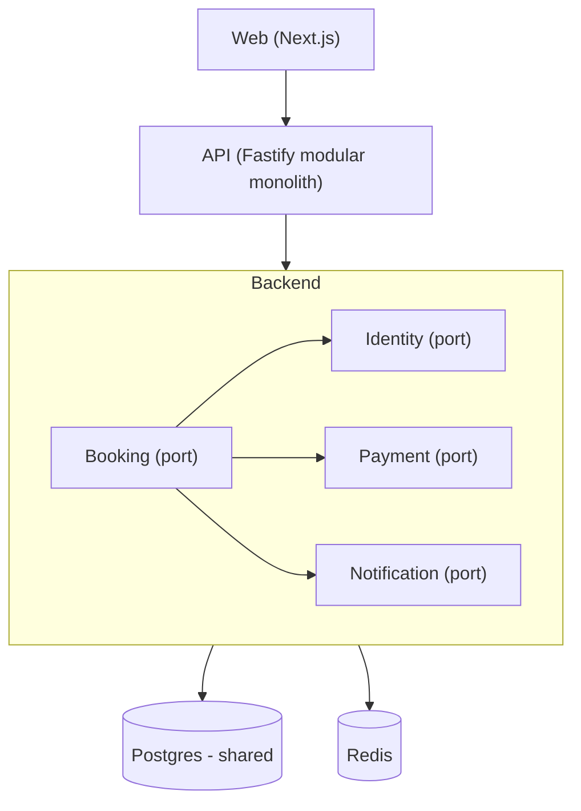

# Profile: hybrid

## Quick reference card (read first — 95% of build tasks only need this)

**Modular monolith today, extractable to microservices tomorrow. Same root layout as monolith — adds extraction discipline INSIDE `apps/api/`.**

```
<slug>/
├── package.json                          ← workspace root (pnpm)
├── pnpm-workspace.yaml                   ← packages: ['apps/*']     (services/* and packages/* added at extraction time)
├── pnpm-lock.yaml
├── tsconfig.base.json
├── biome.json
├── README.md
│
├── apps/
│   ├── api/                              ← modular monolith (extraction-ready)
│   └── web/                              ← frontend
│
├── docker/                               ← dev orchestration (repo root, not inside apps/)
│   ├── compose/
│   ├── environments/
│   └── images/
│
├── scripts/                              ← deploy.sh · health.sh · rollback.sh · smoke.sh
│
└── docs/
    ├── ADR-0001-modular-monolith.md
    └── extraction-playbook.md            ← when + how to extract a module
```

**Default tech picks (same as monolith — listed differences only):**

| Layer             | Default                                               | Notes                                                            |
| ----------------- | ----------------------------------------------------- | ---------------------------------------------------------------- |
| Backend framework | **Fastify** (or NestJS for opinionated DI)            | Same as monolith                                                 |
| ORM               | **Drizzle**                                           | Module-scoped schemas inside one DB                              |
| Events            | **In-process EventEmitter** with Kafka-shaped schemas | Schemas designed so Kafka migration is mechanical                |
| Cache             | **Redis**                                             | Used through a port (swappable)                                  |
| Future broker     | **Kafka**                                             | Added at first extraction (lives in `docker/images/kafka/` then) |

**The hybrid promise:** every module has a `port.ts` interface. When you extract one to `services/<name>/`, only the `compose-root.ts` import changes — business logic moves without rewrites. The extraction recipe is below.

---

## Description

A modular monolith with extraction-ready boundaries. Today the backend
ships as a single deploy (`apps/api/`), one database, fast iteration.
Tomorrow when one module gets too busy, you extract it into
`services/<name>/` with its own deploy and DB — without rewriting
business logic, because every module already talks through interface
ports and references other modules by ID only.

Best fit for ~70% of real projects: teams who say "we want
microservices eventually" but shouldn't pay distributed-systems cost
yet. Speed of monolith now, optionality for later.

**Same layout as monolith** — `apps/api/`, `apps/web/`, `docker/` at root.
The differences are entirely INSIDE `apps/api/src/modules/`: every
module has a `port.ts` interface and `adapters/local.ts` (with a
`remote.ts` stub for extraction day).

`packages/` is **NOT** created upfront. It is added at first
extraction (becomes `packages/ports/`, `packages/events/`,
`packages/proto/`). `services/` is also empty until first extraction.

---

## Folder structure

```
<slug>/                                   ← workspace root
├── package.json
├── pnpm-workspace.yaml                   ← packages: ['apps/*']  (extend at extraction time)
├── pnpm-lock.yaml
├── tsconfig.base.json
├── biome.json
├── .env.example
├── README.md
│
├── apps/
│   ├── api/                              ★ MODULAR MONOLITH — extraction-ready (see "Module shape")
│   ├── web/                              ← frontend (same layout as monolith — see "Standard apps/web/")
│   └── shared/                           ← OPTIONAL — only if FE+BE share TS types not in ports/
│
├── services/                             ★ EMPTY UNTIL FIRST EXTRACTION
│   └── (each extracted service follows microservices.md layout)
│
├── packages/                             ★ EMPTY UNTIL FIRST EXTRACTION
│   └── (at extraction time:
│        packages/ports/        — extraction contracts
│        packages/events/       — Kafka-shaped event schemas
│        packages/proto/        — gRPC contracts)
│
├── docs/
│   ├── ADR-0001-modular-monolith.md
│   └── extraction-playbook.md            ★ HYBRID-SPECIFIC — when + how to extract
├── docker/                               ← dev orchestration (repo root)
│   ├── compose/
│   │   ├── docker-compose.dev.yml        ← FE + monolith + DB + Redis
│   │   ├── docker-compose.images.yml
│   │   ├── docker-compose.staging.yml
│   │   └── docker-compose.prod.yml
│   ├── environments/
│   │   ├── postgres.env
│   │   └── redis.env
│   └── images/
│       ├── postgres/                     ← DEV ONLY
│       ├── redis/
│       └── kafka/                        ★ EMPTY UNTIL FIRST EXTRACTION
│
├── scripts/                              ← repo-root scripts
│   ├── deploy.sh
│   ├── health.sh
│   ├── extract-service.sh                ★ HYBRID-SPECIFIC — automates lifting a module to services/
│   ├── rollback.sh
│   └── smoke.sh
│
└── .github/workflows/
```

---

## `apps/api/` module shape (THIS is what makes hybrid hybrid)

Every backend module under `apps/api/src/modules/<name>/` follows
the same extraction-ready shape:

```
apps/api/src/modules/<name>/
├── port.ts                  ★ INTERFACE — the extraction contract (IUserService, IBookingService, ...)
├── <name>.routes.ts         ← HTTP routes (Fastify) or controllers (NestJS)
├── <name>.service.ts        ← business logic
├── <name>.repo.ts           ← DB access (single DB today; service-owned DB after extraction)
├── <name>.schema.ts         ← zod request/response schemas
├── <name>.events.ts         ← event names + payload schemas (Kafka-shaped)
├── adapters/
│   ├── local.ts             ← imports service.ts directly (TODAY)
│   └── remote.ts            ← gRPC client (added at extraction time)
└── <name>.test.ts
```

**`apps/api/src/compose-root.ts`** is the single wiring point. Today
it imports `adapters/local.ts` for every module. The day a module is
extracted, you change ONE line in compose-root.ts to import
`adapters/remote.ts` instead — and that module is now a separate
service. No business logic changes.

```ts
// apps/api/src/compose-root.ts (today)
import { userServiceLocal as userService } from "./modules/identity/adapters/local";
import { bookingServiceLocal as bookingService } from "./modules/booking/adapters/local";
// after extracting identity:
// import { userServiceRemote as userService } from './modules/identity/adapters/remote';
```

Rest of `apps/api/` layout (server.ts, app.ts, config/, plugins/,
middleware/, events/, jobs/, lib/, utils/, types/, ORM folder, test/)
follows the **monolith profile's "Standard apps/api/ layout"** exactly.

---

## `apps/web/` layout

**Identical to monolith** — see the "Standard apps/web/ layout"
section in `monolith.md`. Same `src/`, `public/`, `docs/`, `test/{unit,e2e}/`,
Next.js or Vite, Tailwind + shadcn, TanStack Query, Zustand, etc.

When some backend modules are extracted, `apps/web/src/lib/api.ts`
points at the API gateway (`docker/gateway/`) instead of the
monolith directly. The gateway transparently routes — frontend code
doesn't change.

---

## ORM folder convention

Same table as monolith (`prisma/` | `drizzle/` | `database/`).

**Rule:** `apps/api/` follows its chosen ORM. When a module is
extracted to `services/<name>/`, that service picks its own ORM (it
doesn't have to match the monolith's).

---

## Frontend / backend / extraction split rules (HARD CONTRACT)

1. **`apps/web/`** = frontend (same as monolith profile).
2. **`apps/api/`** = the modular monolith — ONE backend deploy today, holding all modules.
3. **`apps/api/src/modules/<name>/`** = a single module — ALWAYS contains `port.ts`, `<name>.service.ts`, `<name>.repo.ts`, `<name>.events.ts`, plus `adapters/local.ts` (and `adapters/remote.ts` once extracted).
4. **`docker/`** = dev infra at repo root, NOT inside `apps/`. Scripts at root `scripts/`.
5. **`services/`** = empty at the start. When a module is extracted, it moves here following the microservices layout.
6. **`packages/`** = empty at the start. Created at first extraction: `packages/ports/` lifts the port interfaces, `packages/events/` lifts the event schemas, `packages/proto/` for gRPC.
7. **Folder names role-based, NOT slug-prefixed** — `apps/api/`, `services/booking/`, NOT `apps/<slug>-api/`.

---

## Extraction recipe (the hybrid promise)

When a module is ready to extract (typical signals: scaling pressure,
team ownership boundary, deploy cadence mismatch):

1. **Create `packages/ports/` and `packages/events/`** if they don't exist yet. Update `pnpm-workspace.yaml` to include `packages/*`. **Lift** the module's `port.ts` and `<name>.events.ts` to these packages.
2. **Move** `apps/api/src/modules/<svc>/{service.ts,repo.ts,routes.ts}` → `services/<svc>/src/`. Update `pnpm-workspace.yaml` to include `services/*`.
3. **Add** `services/<svc>/Dockerfile`, `services/<svc>/<orm-folder>/`, `services/<svc>/package.json`, `services/<svc>/kubernetes/`.
4. **Add** `services/<svc>/proto/<svc>.proto` and run protobuf codegen — generated client lands in `packages/proto/`.
5. **Migrate** that module's tables out of the monolith DB into the new service's own DB (script in `scripts/migrate-<svc>.sh`).
6. **Switch** `apps/api/src/compose-root.ts` from `adapters/local.ts` to `adapters/remote.ts` (gRPC client) for the extracted module.
7. **Add** `docker/gateway/` (Kong / Traefik) if not already present; route `/api/<svc>/*` to the new service.
8. **Update** `docker/compose/docker-compose.dev.yml` to include the new service.

The monolith continues serving the other modules. Frontend may continue
calling the monolith for the extracted module (gateway transparently
routes), or be updated to call the gateway directly.

This is mechanical because **the interface (`port.ts`) didn't change**.
The full playbook lives in `docs/extraction-playbook.md`.

---

## Component file organization (frontend) — HARD CONTRACT

**Same standard as the monolith profile.** See `monolith.md` →
"Component file organization (frontend)" — one concern per file,
component self-containment, no static `.map()`, ≤200 lines per file.

---

## Database approach

**Single Postgres instance for the monolith, BUT with strict
per-module ownership.** All tables in one schema, but each module owns
its own tables and other modules reference them by ID only — **no
foreign keys across module boundaries**.

- **Tool:** chosen ORM from SoW Phase 6 — defaults to Drizzle.
- **Tables grouped by module** in the schema file with section comment headers (`// === booking ===`).
- **Cross-module references:** store as IDs only (`booking.customer_id: string`, not a FK to `users.id`).
- **At extraction time:** the extracted service's tables migrate to its own DB; the monolith's references to those tables stay as ID-only strings.

---

## Communication style

**Today: direct imports via ports.** Modules import each other's
service through the `port.ts` interface (not directly):

```ts
// apps/api/src/modules/booking/booking.service.ts
import { UserPort } from './identity/port';

export function createBookingService(userPort: UserPort) {
  return {
    async createBooking(input) {
      const user = await userPort.findById(input.userId);  // ← interface, not direct call
      ...
    }
  };
}
```

The `port.ts` import never changes — only the implementation behind it
(local adapter today, remote gRPC client tomorrow).

- **Sync:** ports + adapters.
- **Async:** in-process EventEmitter today, Kafka tomorrow. Event schemas in `<name>.events.ts` are designed to match Kafka topics so the migration is mechanical.
- **Frontend → Backend:** typed HTTP client in `apps/web/src/lib/api.ts`. No direct calls to module internals — only to public routes registered in `apps/api/src/routes/`.

---

## Mermaid diagram patterns

### System architecture diagram

Modules as separate nodes inside a `Backend` subgraph. Arrows show
port-based dependencies. Mark which modules are "extraction
candidates" with a different color.



### Database diagram

Single `erDiagram` with entities grouped by module. **No FK lines
crossing module boundaries.** Module groupings shown with comment
headers in the schema.

### Infrastructure diagram

Today: same as monolith — one web container + one API container + DB +
Redis. Show extraction targets dashed. Show `docker/gateway/` and
`docker/images/kafka/` as "future" with dashed border.
