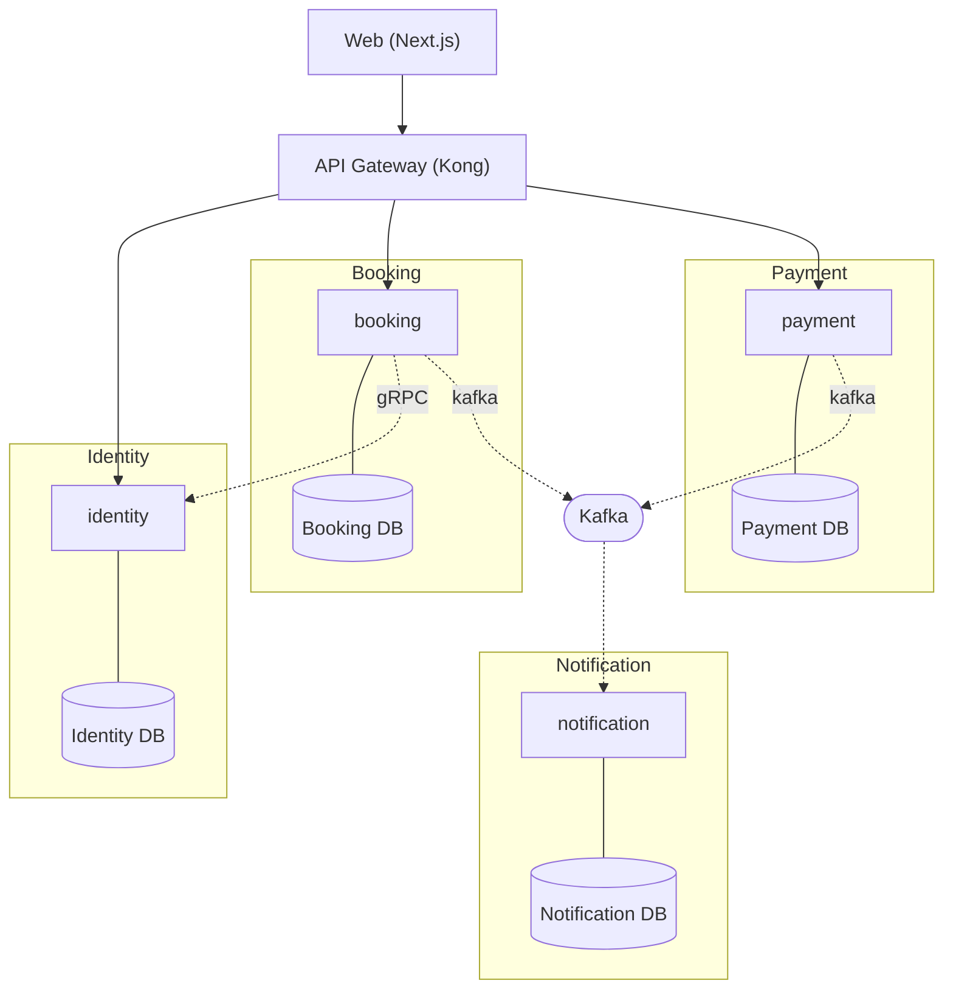

# Profile: microservices

## Quick reference card (read first — 95% of build tasks only need this)

**Independent backend services + frontends + shared packages. Root-level `infra/` because k8s/mesh/gateway are cluster-wide.**

```
<slug>/
├── package.json                          ← workspace root (pnpm)
├── pnpm-workspace.yaml                   ← packages: ['apps/*', 'services/*', 'packages/*']
├── tsconfig.base.json
├── biome.json
│
├── apps/                                 ← user-facing frontends only
│   ├── web/                              ← main SPA / Next.js
│   └── admin/                            ← optional internal dashboard
│
├── services/                             ← backend microservices (one folder per service)
│   ├── identity/
│   ├── booking/
│   ├── payment/
│   └── ...
│
├── packages/                             ← REQUIRED (cross-service contracts)
│   ├── proto/                            ← gRPC contracts (canonical)
│   ├── events/                           ← Kafka event schemas
│   ├── types/                            ← shared TS types (Node services only)
│   └── ui/                               ← shared FE design system (optional)
│
├── docker/                               ← local dev Docker (repo root)
│   ├── compose/                          ← docker-compose.dev.yml · images
│   ├── environments/
│   └── images/                           ← per-service Dockerfiles (local dev)
│
├── scripts/                              ← deploy.sh · health.sh · rollback.sh · smoke.sh
│
└── infra/                                ← CLUSTER-WIDE (not Docker — k8s, mesh, observability)
    ├── kubernetes/                       ← cluster ingress, cert-manager, etc.
    ├── helm/                             ← cluster-wide Helm releases
    ├── mesh/                             ← Istio / Linkerd configs
    ├── gateway/                          ← Kong / Traefik route configs
    └── observability/                    ← prometheus, grafana, otel-collector
```

**Default tech picks:**

| Layer | Default | Alternative |
|---|---|---|
| Backend framework (per service) | **Fastify** (Node) | NestJS / Go chi / Python FastAPI |
| API gateway | **Kong** | Traefik / nginx / AWS API Gateway |
| Service mesh | **Istio** | Linkerd / none |
| Message broker | **Kafka** (REQUIRED) | RabbitMQ |
| Cache | **Redis Cluster** (REQUIRED) | — |
| Database per service | **Postgres** | per-service choice |
| ORM (per service) | **Drizzle** (Node) | Prisma / sqlc (Go) / SQLAlchemy+Alembic (Python) |
| Tracing | **OpenTelemetry → Jaeger/Tempo** | — |
| Orchestration | **Kubernetes** | Nomad / Docker Swarm |
| Frontend | **Next.js + Tailwind + shadcn/ui + TanStack Query + Zustand** | same as monolith |

**Why root-level `infra/` for k8s (vs `docker/` for compose):** `docker/` holds local dev Docker compose + images. `infra/` holds cluster-wide k8s/helm/mesh/observability concerns not owned by any single app. Per-service k8s manifests live inside `services/<svc>/kubernetes/`; cluster-wide manifests live in `infra/`.

---

## Description

Independent backend services, one frontend (or several), all in a
single workspace monorepo. Each service has its own deploy, its own
database, its own lifecycle, and its own scaling style. Services
communicate over the network — gRPC for sync calls, Kafka for async
events. The frontend talks to services through an API gateway. Best
fit for large projects with multiple teams owning different services,
services with genuinely different scaling needs (e.g. media processing
vs auth), or domains where independent release cadence is critical.
Cost: real distributed-systems pain — eventual consistency, network
failures, service-mesh complexity, and a steep operational bar.

## Default tech additions

- **Workspace manager:** pnpm (default) | npm workspaces | yarn workspaces — single lockfile across all apps + services + packages
- **Frontend framework:** Next.js (default) | Vite + React — talks to services via gateway
- **Backend framework:** NestJS (default) | Go (chi/echo) | Python FastAPI — pick per service (polyglot allowed)
- **API gateway:** Kong (default) | Traefik | nginx | AWS API Gateway — public traffic entry, routes `/api/<service>/*` to services
- **Service mesh:** Istio (default) | Linkerd | none — service-to-service mTLS, retries, tracing
- **Message broker:** **Kafka (default, REQUIRED)** | RabbitMQ — async events, must be present
- **Cache:** **Redis cluster (REQUIRED)** — distributed cache, sessions, rate limiting
- **Database per service:** Postgres (default) | MongoDB | per-service choice — separate logical instances
- **ORM / Migration tool:** per-service choice — Prisma | Drizzle | TypeORM | sqlc (Go) | SQLAlchemy+Alembic (Python) — services don't need to agree
- **Tracing:** OpenTelemetry → Jaeger / Tempo — distributed tracing across service boundaries
- **Container orchestration:** Kubernetes (default) | Nomad | Docker Swarm — deployment platform
- **Service discovery:** Kubernetes-native | Consul

## Folder structure

```
<slug>/                                   ← project root = pnpm workspace root
├── package.json                          ← workspace deps (eslint, prettier, husky, ts)
├── pnpm-workspace.yaml                   ← packages: ['apps/*', 'services/*', 'packages/*']
├── pnpm-lock.yaml                        ← single shared lockfile (Node services); Go/Python services manage their own
├── tsconfig.base.json                    ← shared TS config
├── eslint.config.mjs
├── .env.example
├── README.md
│
├── apps/                                 ← user-facing frontends (Node only)
│   ├── web/                              ← see "Standard apps/web/ layout" in monolith.md
│   │   ├── src/                          ← app/ + components/ + features/ + lib/ + hooks/ + ...
│   │   ├── public/                       ← static assets
│   │   ├── docs/                         ← component docs
│   │   ├── test/{unit,e2e}/              ← e2e is REQUIRED for microservices (integration boundary)
│   │   ├── Dockerfile
│   │   ├── next.config.ts | vite.config.ts
│   │   ├── tailwind.config.ts
│   │   ├── biome.json
│   │   ├── tsconfig.json
│   │   └── package.json
│   └── admin/                            ← OPTIONAL — internal admin dashboard (same shape as web/)
│
├── services/                             ← backend microservices (one folder per service)
│   ├── identity/                         ← each service owns EVERYTHING for itself
│   │   ├── src/
│   │   │   ├── bootstrap/                ← DI, retry, timeout, app composition
│   │   │   ├── configs/
│   │   │   ├── database/                 ← ORM client (folder name follows ORM — see below)
│   │   │   ├── events/                   ← Kafka producers + consumers for this service
│   │   │   ├── grpc/                     ← gRPC server impl + clients to OTHER services
│   │   │   ├── modules/                  ← domain logic for THIS service only
│   │   │   ├── routes/                   ← HTTP routes (if service exposes REST too)
│   │   │   ├── shared/{constants,errors,middlewares,plugins,types,utils}
│   │   │   └── server.ts
│   │   ├── <orm-folder>/                 ← prisma/ | drizzle/ | database/ (see "ORM folder")
│   │   ├── proto/
│   │   │   └── identity.proto            ← gRPC contract (mirrored from packages/proto/)
│   │   ├── tests/{unit, integration, contract}
│   │   ├── kubernetes/                   ← service-specific manifests
│   │   │   ├── deployment.yaml
│   │   │   ├── service.yaml
│   │   │   ├── hpa.yaml                  ← horizontal pod autoscaler
│   │   │   └── ingress.yaml              ← only if directly exposed
│   │   ├── helm/                         ← OPTIONAL Helm chart for this service
│   │   ├── package.json (or go.mod / pyproject.toml — language-dependent)
│   │   ├── Dockerfile                    ← multi-stage build
│   │   ├── tsconfig.json (Node only)
│   │   └── README.md
│   ├── booking/                          ← same shape as identity/
│   ├── payment/                          ← same shape
│   ├── notification/                     ← same shape
│   └── ...                               ← one folder per service, all the same shape
│
├── packages/                             ← shared code (workspace members)
│   ├── proto/                            ← canonical gRPC contracts (source of truth)
│   │   ├── common.proto
│   │   ├── identity.proto
│   │   ├── booking.proto
│   │   └── package.json                  ← name: "@<slug>/proto"
│   ├── events/                           ← Kafka topic schemas + types
│   │   ├── schemas/
│   │   │   ├── booking-created.json      ← Avro / JSON Schema
│   │   │   └── payment-completed.json
│   │   └── package.json                  ← name: "@<slug>/events"
│   ├── ui/                               ← OPTIONAL — shared FE design system
│   │   └── package.json                  ← name: "@<slug>/ui"
│   └── types/                            ← OPTIONAL — shared TS types not in proto
│       └── package.json
│
├── infra/                                ★ ROOT-LEVEL — cluster-wide infrastructure
│   ├── compose/
│   │   ├── docker-compose.development.yml    ← FE + ALL services + Kafka + Redis + Postgres + Jaeger
│   │   ├── docker-compose.staging.yml
│   │   └── docker-compose.images.yml         ← prebuilt images for CI/registry
│   ├── docker/                           ← Dockerfiles for backing services (DEV ONLY)
│   │   ├── kafka/                        ← Dockerfile + server.properties
│   │   ├── redis/                        ← Dockerfile + redis.conf
│   │   ├── postgres/                     ← Dockerfile + init-per-service/  (DEV ONLY — prod uses managed DBs)
│   │   ├── zookeeper/                    ← if Kafka requires it
│   │   └── nginx/                        ← OPTIONAL — local edge proxy
│   ├── kubernetes/                       ← cluster-wide manifests (NOT per-service)
│   │   ├── namespace.yaml
│   │   ├── ingress-controller/           ← nginx-ingress / traefik
│   │   ├── cert-manager/
│   │   ├── secrets/                      ← sealed-secrets / external-secrets
│   │   └── network-policies/
│   ├── helm/                             ← cluster-wide charts (NOT per-service)
│   │   └── (umbrella chart that pulls in each service's chart)
│   ├── mesh/                             ← Istio / Linkerd config
│   │   ├── istio-base.yaml
│   │   ├── virtualservices/
│   │   └── destinationrules/
│   ├── gateway/                          ← API gateway config
│   │   ├── kong/                         ← kong.yaml or declarative routes
│   │   ├── routes.yaml
│   │   └── plugins/                      ← rate limit, JWT, CORS
│   ├── observability/
│   │   ├── prometheus/                   ← scrape configs, alert rules
│   │   ├── grafana/                      ← dashboards
│   │   ├── jaeger.yaml | tempo.yaml      ← distributed tracing backend
│   │   ├── otel-collector.yaml           ← OpenTelemetry collector config
│   │   └── loki.yaml                     ← log aggregation
│   ├── environments/                     ← per-service env files (dev only — prod via Vault/SealedSecrets)
│   │   ├── identity.env
│   │   ├── booking.env
│   │   ├── kafka.env
│   │   └── ...
│   └── scripts/
│       ├── deploy.sh                     ← cluster deploy orchestrator
│       ├── seed-topics.sh                ← create Kafka topics
│       ├── health.sh
│       └── rollback.sh
│
├── docs/                                 ← project docs (ADRs, runbooks, service catalog)
│   └── services/<service>/runbook.md     ← one runbook per service
└── .github/workflows/                    ← CI: lint, typecheck, test, contract tests, build per-service images, deploy
```

### ORM folder convention (same as monolith — applied per service)

Each service picks its own ORM and uses its language's convention. The
folder inside `services/<svc>/` adapts to the chosen tool:

| Language + ORM         | Folder name           | Contents                                   |
|------------------------|-----------------------|--------------------------------------------|
| Node + **Prisma**      | `prisma/`             | `schema.prisma` + `migrations/` + `seed.ts`|
| Node + **Drizzle**     | `drizzle/`            | `schema.ts` + `migrations/`                |
| Node + **TypeORM**     | `database/`           | `entities/` + `migrations/`                |
| Node + **Sequelize**   | `database/`           | `models/` + `migrations/` + `seeders/`     |
| Node + **Kysely**      | `database/`           | `schema.ts` + `migrations/`                |
| Go + **sqlc**          | `db/queries/` + `db/migrations/` | `.sql` files + `sqlc.yaml`      |
| Go + **GORM**          | `database/`           | structs + Atlas/golang-migrate migrations  |
| Python + **SQLAlchemy + Alembic** | `database/` + `alembic/` | models + migration scripts        |
| Java + **JPA + Flyway**| `src/main/resources/db/migration/` | Flyway SQL files              |

**Rule:** services don't need to agree on ORM or language. Each
service's folder follows its own language convention. Build engine
reads each service's stack from SoW Phase 6 and lays out the right
folder accordingly.

### Frontend / backend / shared split rules

1. **`apps/`** = user-facing frontends only (web, admin, mobile-web). One folder per UI app.
2. **`services/`** = backend microservices. One folder per service, each with its own DB + Dockerfile + k8s manifests.
3. **`packages/`** = workspace-shared libraries (`proto`, `events`, `ui`, `types`). Importable by apps and Node services.
4. **`infra/`** = root-level cluster-wide infrastructure. Per-service k8s lives inside the service; cluster-wide configs live in `infra/kubernetes/` and `infra/helm/`.
5. **No service imports another service's `src/`.** Cross-service code reuse goes through `packages/proto/` (contracts) or `packages/events/` (schemas).
6. **Folder names are role-based, NOT slug-prefixed** — `services/identity/`, NOT `services/<slug>-identity/`.

### Component file organization (frontend apps) — HARD CONTRACT

Applies to every UI app under `apps/` (web, admin, mobile-web):

1. **One concern per file.** Pages orchestrate sections only — they do NOT contain section JSX. Split by **logic boundary**:
   ```
   apps/web/src/features/profile/
     ProfilePage.tsx                ← orchestrator only
     components/
       ProfileAvatar.tsx
       ProfilePersonalInfo.tsx
       ProfileUpdatePassword.tsx
       ProfileDeleteAccount.tsx
   apps/web/src/shared/components/header/
     Header.tsx
     HeaderLogo.tsx
     HeaderNav.tsx                  ← nav items as JSX inside this file
     HeaderUserMenu.tsx
   apps/web/src/shared/components/footer/
     Footer.tsx
     FooterLinks.tsx
     FooterSocial.tsx
   ```

2. **Component self-containment.** Static UI data (nav items, footer link groups, FAQ rows, dropdown options, social icons) lives **inside the component file that renders it**. Pages NEVER pass static arrays as props.

3. **Translation is the only allowed external dependency.** Components call `t('header.nav.home')` directly; i18n keys live in locale files, not in prop arrays.

4. **No `.map()` for static lists.** If the list is fixed at build time, render each item as explicit JSX. `.map()` is reserved for dynamic data from API/gateway.

5. **File size budget.** 50–200 lines per file. Past ~200 → split.

6. **Pages pass dynamic data only** — authenticated user, fetched API data, route state, callbacks. Never static UI scaffolding.

7. **Cross-app reuse goes through `packages/ui/`**, not page props. If `Header` is shared across `apps/web/` and `apps/admin/`, lift it to `packages/ui/header/` — and the same self-containment rule still applies inside the package.

### Per-service vs cluster-wide infra (clear split)

| Concern | Lives in | Why |
|---|---|---|
| Service Deployment + Service + HPA | `services/<svc>/kubernetes/` | Owned by service team |
| Service Helm chart | `services/<svc>/helm/` | Service-specific values |
| Cluster ingress controller | `infra/kubernetes/ingress-controller/` | One per cluster |
| Service mesh (Istio / Linkerd) | `infra/mesh/` | Cluster-wide |
| API gateway (Kong) | `infra/gateway/` | One entry point |
| Observability stack | `infra/observability/` | Shared by all services |
| Kafka cluster config | `infra/docker/kafka/` (dev) + `infra/helm/kafka/` (prod) | Shared infrastructure |
| Per-service Kafka topic creation | `scripts/seed-topics.sh` | Single source of truth |

## Database approach

**Strict DB per service. No exceptions.**

- Each service has its **own Postgres instance** (or its own logical DB on a shared cluster — but with its own credentials and no cross-DB queries).
- **Cross-service references stored as IDs only** — `booking.customer_id` is just a UUID string, not a foreign key to identity-service's `users` table.
- **Cross-service data fetched via API call (gRPC) or Kafka event consumption.** Never direct SQL.
- Each service has its **own migration history** in its own ORM folder.
- Schema changes **never coordinate across services** — each can deploy independently.
- **Tool:** chosen per service (services don't need to agree)
- **Dev DB:** dockerized via `infra/docker/postgres/` with one logical DB per service (init scripts in `infra/docker/postgres/init-per-service/`)
- **Prod DB:** managed services (Supabase / RDS / Cloud SQL) — one instance per service or a shared cluster with strict isolation
- **Anti-pattern alert:** "shared DB with separate schemas" looks tempting but defeats the purpose. Don't do it.

## Communication style

**Network-only. No direct imports between services.**

- **Sync calls:** gRPC (with protobuf contracts in `packages/proto/`). REST allowed for the API gateway's public surface only.
- **Async events:** Kafka. Every meaningful state change publishes an event with schema in `packages/events/schemas/`.
- **Boundary discipline:** strict — services share NOTHING except contract files in `packages/proto/` and event schemas in `packages/events/`. No shared business logic, no shared types beyond protobuf-generated types.
- **Service-to-service auth:** mTLS via service mesh (Istio) OR JWT-with-service-claims if no mesh.
- **Backpressure / retries:** built into clients (gRPC retry policy, Kafka consumer commit semantics, idempotency keys for sync calls).
- **Frontend → Backend:** the SPA never calls services directly. All traffic goes `apps/web` → API gateway (`infra/gateway/`) → service. The gateway terminates TLS, applies rate limits, and routes `/api/<service>/*` paths.

```ts
// services/booking/src/modules/booking/handler.ts
import { identityClient } from '../../grpc/clients/identity';
import { kafka } from '../../events/producer';

export async function createBooking(input) {
  const user = await identityClient.getUser({ id: input.userId });   // gRPC call across the mesh
  const booking = await db.bookings.insert(input);
  await kafka.publish('booking.created', { bookingId: booking.id, userId: input.userId });
  return booking;
}
```

## Mermaid diagram patterns

### System architecture diagram

Each service in its own subgraph with its own DB inside. Network arrows
between subgraphs (NOT inside). Gateway node out front. Kafka shown as
a horizontal "event bus" crossing the bottom with dashed orange arrows
(`linkStyle ... stroke-dasharray:6 4`) to/from each service.



### Database diagram

Multiple `erDiagram` blocks — one per service — separated by
`<h2>Service: <name></h2>` headings. **No FK lines crossing service
boundaries.** Cross-service refs annotated as
`# ref→users.id (in identity-service DB)`.

### Infrastructure diagram

Per-service nodes in subgraphs, each with its own Deployment +
Service + DB. Cluster-wide nodes (Kafka cluster, Redis cluster, API
gateway, service-mesh control plane, observability stack) shown as
separate nodes outside service subgraphs. Distinct `classDef` colors
per layer (apps / services / data / messaging / infra / observability /
external). Show the ingress path from public DNS → gateway → mesh →
services.
