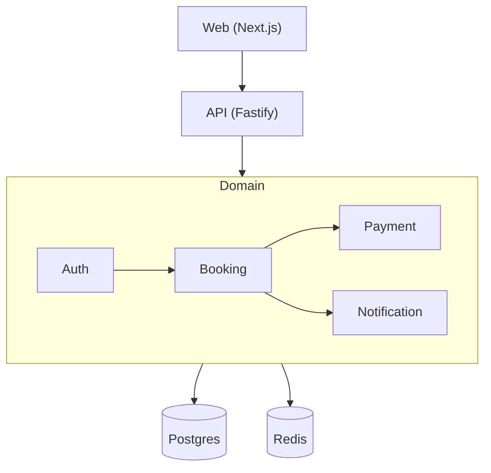

# Profile: monolith

## Quick reference card (read first — 95% of build tasks only need this)

**One product, one team, one repo. Backend monolith + frontend SPA + `docker/` at root for dev infra.**

```
<slug>/
├── package.json                          ← workspace root (pnpm)
├── pnpm-workspace.yaml                   ← packages: ['apps/*']
├── pnpm-lock.yaml
├── tsconfig.base.json
├── biome.json | eslint.config.mjs        ← lint+format (Biome default)
├── .env.example
├── README.md
│
├── apps/
│   ├── api/                              ← backend monolith
│   └── web/                              ← frontend
│
├── docker/                               ← dev orchestration (root level, not inside apps/)
│   ├── compose/                          ← docker-compose.dev / staging / prod / images
│   ├── environments/                     ← postgres.env · redis.env · api.env
│   └── images/                           ← Dockerfiles per service (postgres, redis, nginx)
│
├── scripts/                              ← deploy.sh · health.sh · rollback.sh · smoke.sh
│
└── docs/                                 ← project-level docs (ADRs, runbooks)
```

**Default tech picks (chosen for lighter / faster / more common):**

| Layer | Default | Alternative |
|---|---|---|
| Package manager | **pnpm** | npm / yarn (workspaces) |
| Backend framework | **Fastify** (lighter, 2-3× faster than Express) | NestJS (opinionated) / Express |
| ORM | **Drizzle** (lighter, faster cold start, edge-compat) | Prisma (mature tooling) |
| Database | **Postgres** | MySQL |
| Validation | **Zod** | Yup / Joi |
| Logger | **Pino** | Winston |
| Jobs | **BullMQ** (Redis) | Agenda (Mongo) |
| Cache | **Redis** | in-memory (LRU) |
| Frontend framework | **Next.js 16 App Router** | Vite + React |
| Styling | **Tailwind v4 + shadcn/ui** | CSS Modules |
| Server state | **TanStack Query** | SWR |
| Client state | **Zustand** (1KB) | Redux Toolkit |
| Forms | **react-hook-form + Zod** | Formik |
| i18n | **next-intl** | i18next |
| Tests | **Vitest** + **Playwright** | Jest + Cypress |
| Lint+Format | **Biome** (one tool, 10-15× faster) | ESLint + Prettier |
| Auth | **@fastify/jwt** + argon2 | NextAuth (if Next-only) |

**Rule of thumb:** when SoW Phase 6 leaves a slot unspecified, use the **Default** column. When the SoW specifies an alternative, follow the SoW.

---

## Description

One product, one team, one repo. Frontend and backend live as separate
**workspace members** under `apps/`. Shared dev infrastructure
(compose, dev docker images, scripts) sits at `docker/` at the repo
root. Scripts live at root `scripts/`. The backend itself is monolithic — one API
process, one database, modules import each other freely. Best fit for
small-to-medium products with a single team where speed-to-market beats
distributed-system flexibility.

`packages/` is **NOT** created by default for monolith. Shared
TypeScript types between FE and BE live in `apps/shared/types/` only
when actually needed (DTOs, enums consumed by both sides).

---

## Folder structure

```
<slug>/                                   ← project root = pnpm workspace
├── package.json                          ← workspace deps (Biome, husky, ts)
├── pnpm-workspace.yaml                   ← packages: ['apps/*']
├── pnpm-lock.yaml
├── tsconfig.base.json
├── biome.json                            ← lint+format (or eslint.config.mjs)
├── .env.example
├── .editorconfig
├── .gitignore
├── README.md
│
├── apps/
│   ├── api/                              ← backend monolith (see "Standard apps/api/ layout")
│   ├── web/                              ← frontend (see "Standard apps/web/ layout")
│   │
│   └── shared/                           ← OPTIONAL — create only if FE+BE share TS types
│       ├── types/                        ← imported by both api + web
│       ├── constants/
│       └── package.json                  ← name: "@<slug>/shared"
│
├── docker/                               ← dev orchestration (repo root, not inside apps/)
│   ├── compose/
│   │   ├── docker-compose.dev.yml        ← FE + BE + dev DB + Redis
│   │   ├── docker-compose.images.yml     ← builds all custom images
│   │   ├── docker-compose.staging.yml
│   │   └── docker-compose.prod.yml       ← uses managed DB — only app images
│   ├── environments/                     ← per-service env files
│   │   ├── postgres.env
│   │   ├── redis.env
│   │   └── api.env
│   └── images/                           ← DEV ONLY images
│       ├── postgres/                     ← Dockerfile + init/ + postgres.conf
│       ├── redis/                        ← Dockerfile + redis.conf
│       └── nginx/                        ← optional reverse proxy
│
├── scripts/                              ← repo-root scripts
│   ├── deploy.sh
│   ├── health.sh
│   ├── rollback.sh
│   └── smoke.sh
│
├── docs/                                 ← project-level docs (ADRs, runbooks)
└── .github/workflows/                    ← CI: lint, typecheck, test, build, deploy
```

**Per-app `Dockerfile` lives INSIDE each app** (`apps/api/Dockerfile`,
`apps/web/Dockerfile`). `docker/` orchestrates them but does not own them.

---

## Standard `apps/api/` layout (Fastify default)

```
apps/api/
├── src/
│   ├── server.ts                ← entry: build + start Fastify
│   ├── app.ts                   ← Fastify instance + plugin registration
│   ├── config/
│   │   ├── env.ts               ← zod-validated process.env loader
│   │   └── database.ts          ← DB pool config
│   ├── plugins/                 ← Fastify plugins (cross-cutting)
│   │   ├── auth.ts              ← JWT verify hook
│   │   ├── cors.ts
│   │   ├── helmet.ts
│   │   ├── rate-limit.ts
│   │   └── swagger.ts           ← auto-OpenAPI from zod schemas
│   ├── modules/                 ← feature modules (one folder per bounded context)
│   │   ├── auth/
│   │   │   ├── auth.routes.ts   ← POST /login, /signup, /refresh
│   │   │   ├── auth.service.ts  ← business logic, no HTTP
│   │   │   ├── auth.schema.ts   ← zod request/response schemas
│   │   │   ├── auth.repo.ts     ← DB access
│   │   │   └── auth.test.ts
│   │   ├── users/
│   │   ├── bookings/
│   │   └── ...
│   ├── middleware/              ← global hooks (error handler, request-id, audit)
│   ├── events/                  ← internal EventEmitter handlers (booking.created, etc.)
│   ├── jobs/                    ← BullMQ producers + consumers
│   │   ├── email-queue.ts
│   │   └── cleanup-queue.ts
│   ├── lib/                     ← third-party SDK wrappers (typed, mockable)
│   │   ├── stripe.ts
│   │   ├── sendgrid.ts
│   │   └── s3.ts
│   ├── utils/
│   │   ├── logger.ts            ← Pino instance
│   │   ├── errors.ts            ← AppError, NotFoundError, UnauthorizedError
│   │   └── crypto.ts
│   ├── types/                   ← shared TS types (FastifyRequest augmentations)
│   └── <orm-folder>/            ← prisma/ | drizzle/ | database/ (see ORM table)
├── test/
│   ├── integration/             ← supertest against real Fastify instance
│   ├── e2e/                     ← optional, when API has multi-step flows
│   ├── unit/                    ← isolated function tests
│   └── helpers/                 ← test-db setup, fixtures
├── docs/
│   └── openapi.yaml             ← auto-emitted by Swagger plugin
├── Dockerfile
├── package.json
├── tsconfig.json                ← extends ../../tsconfig.base.json
└── README.md
```

**Module shape rule:** every module has exactly the same internal
shape (`*.routes.ts`, `*.service.ts`, `*.schema.ts`, `*.repo.ts`,
`*.test.ts`). Predictability beats cleverness — builders can find
any file by name pattern.

**For NestJS (alternative):** replace `modules/<name>/{routes,service,schema,repo,test}` with the NestJS module convention (`<name>.module.ts`, `<name>.controller.ts`, `<name>.service.ts`, `<name>.dto.ts`, `<name>.spec.ts`). Everything else identical.

---

## Standard `apps/web/` layout (Next.js 16 App Router default)

```
apps/web/
├── src/
│   ├── app/                     ← Next.js App Router (route groups + layouts)
│   │   ├── (public)/            ← unauthenticated routes
│   │   ├── (auth)/              ← login/signup routes
│   │   ├── (dashboard)/         ← authenticated routes
│   │   ├── api/                 ← Route Handlers (only for BFF; main API in apps/api/)
│   │   ├── layout.tsx           ← root layout (providers, fonts)
│   │   └── page.tsx             ← landing
│   ├── components/              ← global / shared components
│   │   ├── ui/                  ← shadcn primitives (Button, Input, Dialog, ...)
│   │   ├── header/              ← Header.tsx + HeaderNav.tsx + HeaderLogo.tsx + HeaderUserMenu.tsx
│   │   ├── footer/              ← Footer.tsx + FooterLinks.tsx + FooterSocial.tsx
│   │   └── layouts/             ← AppShell, AuthShell
│   ├── features/                ← feature-sliced UI (mirrors backend modules)
│   │   ├── booking/
│   │   │   ├── BookingPage.tsx  ← orchestrator only
│   │   │   ├── components/      ← BookingSearchForm.tsx, BookingResultList.tsx, ...
│   │   │   ├── api/             ← TanStack Query hooks (useBookings, useCreateBooking)
│   │   │   └── types.ts
│   │   └── ...
│   ├── lib/                     ← third-party wrappers, utilities
│   │   ├── api.ts               ← typed fetch client (zod-validated responses)
│   │   ├── auth.ts              ← session helpers
│   │   └── utils.ts             ← cn() etc.
│   ├── hooks/                   ← shared React hooks
│   ├── store/                   ← Zustand stores (client UI state only)
│   ├── providers/               ← React context (Theme, Query, Auth)
│   ├── styles/                  ← globals.css + tokens.css
│   ├── i18n/                    ← locale files (en.json, ru.json, uz.json) + config
│   ├── middleware/              ← Next.js middleware.ts (auth gates, redirects)
│   ├── plugins/                 ← (optional) custom webpack/vite plugins
│   └── types/                   ← shared TS types
├── public/                      ← static assets
│   ├── images/
│   ├── fonts/
│   └── favicon.ico
├── docs/                        ← component docs (.md or Storybook)
│   └── components.md
├── test/
│   ├── unit/                    ← Vitest + React Testing Library — ALWAYS
│   └── e2e/                     ← Playwright — added when Page Inventory has ≥3 multi-step flows
├── Dockerfile
├── next.config.ts
├── tailwind.config.ts
├── biome.json                   ← can extend root config
├── tsconfig.json                ← extends ../../tsconfig.base.json
└── package.json
```

**For Vite + React (alternative):** replace `app/` with `pages/` (or
React Router definitions in `app/router.tsx`), `next.config.ts` with
`vite.config.ts`, and remove the `app/api/` route handlers (use the
main API directly).

**When `test/e2e/` is created:** if SoW Page Inventory lists ≥3 pages
with multi-step user flows (auth + checkout, signup + onboarding, etc.)
OR architecture style escalates to microservices later. Otherwise unit
tests in `test/unit/` are sufficient.

---

## ORM folder convention

The `<orm-folder>` inside `apps/api/` adapts to the chosen ORM:

| ORM | Folder | Contents |
|---|---|---|
| **Drizzle** (default) | `drizzle/` | `schema.ts` + `migrations/` + `drizzle.config.ts` |
| **Prisma** | `prisma/` | `schema.prisma` + `migrations/` + `seed.ts` |
| **TypeORM** | `database/` | `entities/` + `migrations/` + `data-source.ts` |
| **Sequelize** | `database/` | `models/` + `migrations/` + `seeders/` + `config/` |
| **Kysely** | `database/` | `schema.ts` + `migrations/` + types |
| **MikroORM** | `database/` | `entities/` + `migrations/` + `mikro-orm.config.ts` |

**Rule:** if the ORM ships a CLI that expects a specific folder
(Prisma, Drizzle), use that folder name. Otherwise use the generic
`database/` folder.

---

## Frontend / backend split rules (HARD CONTRACT)

1. **Always split FE and BE** at `apps/` level. One combined folder is forbidden.
2. **Folder names are role-based, NOT slug-prefixed** — `apps/api/`, `apps/web/`, NOT `apps/<slug>-api/`. The workspace root is already the slug.
3. **Each app owns** its own `package.json`, `Dockerfile`, `tsconfig.json` (extends root base), `test/`, `README.md`.
4. **Workspace root owns shared concerns** — Biome/ESLint config, husky, ts, lockfile, root `.env.example`.
5. **`docker/` lives at the repo root**, next to `apps/`. NOT inside `apps/`. Scripts live at root `scripts/`.
6. **`apps/shared/` is optional** — create only when FE+BE share TypeScript types (DTOs, enums). For non-TS stacks, skip.
7. **`packages/` is NOT created** for monolith style. If you find yourself wanting it, you've probably outgrown monolith — consider hybrid.

---

## Component file organization (frontend) — HARD CONTRACT

These rules apply to every frontend file under `apps/web/src/`:

1. **One concern per file.** Pages orchestrate sections only — they do NOT contain section JSX. Split each page by **logic boundary**:
   ```
   apps/web/src/features/profile/
     ProfilePage.tsx                ← orchestrator only (composes children)
     components/
       ProfileAvatar.tsx
       ProfilePersonalInfo.tsx
       ProfileUpdatePassword.tsx
       ProfileDeleteAccount.tsx
   apps/web/src/components/header/
     Header.tsx                     ← container
     HeaderLogo.tsx
     HeaderNav.tsx                  ← nav items INSIDE this file as JSX, not as prop array
     HeaderLanguageSwitcher.tsx
     HeaderUserMenu.tsx
   apps/web/src/components/footer/
     Footer.tsx
     FooterLinks.tsx                ← link groups INSIDE this file
     FooterSocial.tsx
     FooterNewsletter.tsx
   ```

2. **Component self-containment.** Static UI data (nav items, footer links, FAQ rows, dropdown options, social icons, hero feature lists, language list) lives **inside the component file that renders it**. Pages NEVER pass static arrays as props.

3. **Translation is the only allowed external dependency.** Components call `t('header.nav.home')` directly. i18n keys live in locale files, not in prop arrays.

4. **No `.map()` for static lists.** If the list is fixed at build time, render each item directly as JSX. `.map()` is reserved for dynamic data from API/DB/store.

5. **File size budget.** 50–200 lines per component file. Past ~200 lines or two unrelated logic concerns → split immediately.

6. **Dynamic data only flows via props.** Pages may pass: the authenticated user, fetched API/DB content, route state, callbacks. Pages may NOT pass: static UI scaffolding.

**Anti-pattern (FAIL):** `<Header items={navItems} />` where `navItems = [{href:'/',label:'Home'}, ...]` defined in the page.
**Correct:** `<Header />` and `HeaderNav.tsx` renders `<NavLink to="/">{t('header.nav.home')}</NavLink>` per item.

---

## nginx clarification (two roles, two locations)

| Role | Location | Purpose |
|---|---|---|
| **Reverse proxy** in front of API | `docker/images/nginx/` | TLS, rate limit, route `/api/*` → api:3000, `/*` → web:80 |
| **SPA static server** for FE (Vite only) | `apps/web/nginx.conf` | Serves `apps/web/dist/` inside the web Dockerfile |

Drop `docker/images/nginx/` if deploying behind a managed LB
(Cloudflare, Vercel, AWS ALB) or if Next.js serves both UI and API
routes directly.

---

## Database approach

**Single Postgres instance.** All tables in one schema. Foreign keys
allowed across modules. Modules can JOIN across each other's tables.
Migrations are a single linear history.

- **Tool:** chosen ORM from SoW Phase 6 — defaults to **Drizzle**.
- **Cross-module data:** direct SQL JOINs allowed.
- **Schema ownership:** shared.
- **Dev DB:** dockerized via `docker/images/postgres/`.
- **Prod DB:** managed service (Neon / Supabase / RDS) — the dockerized image is DEV ONLY.

---

## Communication style

**Direct in-process function calls.** Modules import each other's
service files directly:

```ts
// apps/api/src/modules/booking/booking.service.ts
import { sendNotification } from '../notification/notification.service';
await sendNotification(userId, 'booked');
```

- **Sync:** direct imports between modules — no interfaces required.
- **Async:** in-process EventEmitter for fire-and-forget side effects.
- **Boundary discipline:** loose — speed > strict separation.
- **No** network overhead, **no** serialization, **no** distributed-system pain.
- **Frontend → Backend:** typed HTTP client in `apps/web/src/lib/api.ts` consuming types from `apps/shared/types/` (when present).

---

## Mermaid diagram patterns

### System architecture diagram



### Database diagram

Single `erDiagram` block — all entities together. FK lines cross
module boundaries freely. No service grouping.

### Infrastructure diagram

One web container + one API container + one Postgres + (optional)
Redis + external integrations. Show the `apps/infra/compose/` file
that orchestrates the stack. No message broker, no service mesh, no
gateway unless reverse-proxy nginx is used.
