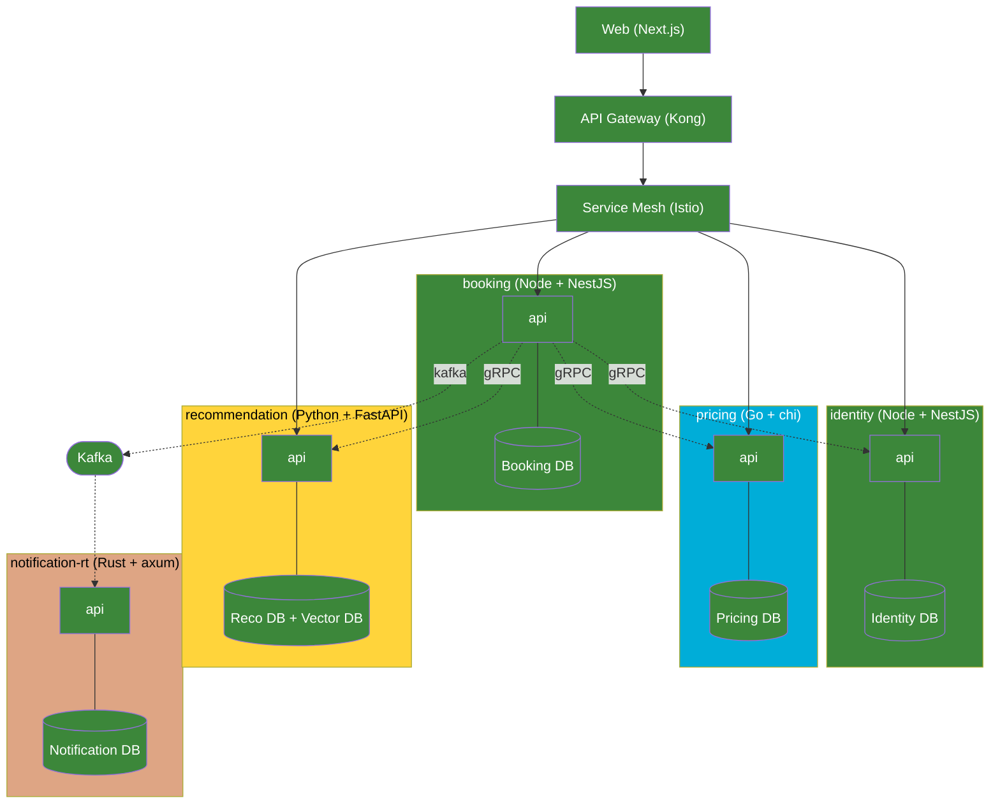

# Profile: polyglot-microservices

## Quick reference card (read first — 95% of build tasks only need this)

**Microservices in multiple languages (Node + Go + Python + Java/Kotlin + Rust). Root `infra/` because cluster-wide. `apps/web/` always Node.**

```
<slug>/
├── package.json                          ← pnpm workspace (Node apps + Node services + Node packages)
├── pnpm-workspace.yaml                   ← packages: ['apps/*', 'services/*' (Node ones), 'packages/*']
├── pnpm-lock.yaml
├── go.work                               ← Go workspace (Go services)
├── pyproject.toml                        ← Python workspace (uv-managed)
├── settings.gradle.kts                   ← JVM workspace (Java/Kotlin)
├── Cargo.toml                            ← Rust workspace (workspace = ["services/<rust-svc>"])
├── biome.json
│
├── apps/
│   ├── web/                              ← always Node (Next.js)
│   └── admin/                            ← optional Node app
│
├── services/                             ← flat by domain, language is implementation detail
│   ├── identity/                         ← Node (NestJS or Fastify)
│   ├── booking/                          ← Node
│   ├── pricing/                          ← Go (chi)
│   ├── recommendation/                   ← Python (FastAPI)
│   ├── search/                           ← Java/Kotlin (Spring Boot)
│   └── notification-rt/                  ← Rust (axum)
│
├── packages/
│   ├── proto/                            ← canonical .proto files
│   ├── proto-ts/, proto-go/, proto-py/   ← generated stubs (committed)
│   ├── events/                           ← Avro/JSON Schema event definitions
│   └── ui/, ts-types/                    ← Node-only (apps + Node services)
│
├── tools/
│   └── codegen/                          ← buf config + per-language codegen scripts
│
├── docs/
│   └── language-baseline/                ← <lang>.md per language (style, tooling, observability)
│
├── docker/                               ← local dev Docker (repo root)
│   ├── compose/
│   ├── environments/
│   └── images/
│
├── scripts/                              ← deploy.sh · health.sh · rollback.sh · smoke.sh
│
└── infra/                                ← CLUSTER-WIDE (k8s, mesh, gateway — NOT Docker)
    ├── kubernetes/, helm/, mesh/, gateway/, observability/
```

**Default tech picks per language:**

| Language | Framework | ORM / DB tool | Key libs |
|---|---|---|---|
| **Node** | Fastify or NestJS | Drizzle / Prisma | Zod, Pino, BullMQ |
| **Go** | chi | sqlc + golang-migrate | zerolog, zap |
| **Python** | FastAPI | SQLAlchemy + Alembic | pydantic, structlog, uv |
| **Java/Kotlin** | Spring Boot | Spring Data JPA + Flyway | Logback |
| **Rust** | axum | sqlx + sqlx-cli | tracing, serde |
| **All** | gRPC + Kafka | per-service Postgres | OpenTelemetry SDK |

**The 5 hard rules** (see full text below): canonical `packages/proto/`, uniform Makefile targets per service, DB-per-service, OpenTelemetry everywhere, language-baseline docs per language.

---

## Description

Independent backend services like `microservices.md`, but each service
is implemented in the language best suited to its workload — Node for
the typical CRUD/HTTP services, Go for compute-heavy and low-latency
work, Python for data-science / ML, Java or Kotlin for heavy enterprise
or JVM-ecosystem fits, Rust for the lowest-latency or memory-critical
paths. The frontend stays Node (Next.js / Vite-React). All services
communicate via gRPC and Kafka — no shared business logic is possible
across the language barrier, which forces clean contracts. Best fit
for projects where one or two services have genuinely different runtime
characteristics from the rest (heavy compute, ML inference, real-time
processing, deep ecosystem dependence) and a single language can't
serve them all well. Cost: distributed-systems pain plus polyglot
operational overhead — multiple toolchains, multiple lockfiles,
per-language CI matrices, codegen pipeline for contracts, and the
discipline to keep 3-5 language stacks aligned on observability,
auth, and deploy patterns.

## Default tech additions

- **Workspace strategy:** loose polyglot — one Node workspace + one Go workspace + one Python workspace, each managing its own services. Root `Makefile` orchestrates across all of them.
- **Node:** pnpm workspace (default) — covers `apps/*`, Node services in `services/*`, Node packages in `packages/*`
- **Go:** `go.work` at root — lists each Go service module
- **Python:** `pyproject.toml + uv.lock` at root with uv workspace (default) | per-service if not unified
- **Java/Kotlin:** Gradle multi-project (`settings.gradle.kts` at root) or per-service Gradle | Maven multi-module
- **Rust:** Cargo workspace at root (`Cargo.toml [workspace]`) covering Rust services
- **Root orchestration:** **Makefile** (default — universal, zero-install) | justfile | Taskfile.yml | Bazel (only for very large teams)
- **Frontend framework:** Next.js (default) | Vite + React — talks to services via gateway
- **Backend frameworks (per language):**
  - Node: NestJS (default) | Fastify | Express
  - Go: chi (default) | echo | fiber + connect-go for gRPC
  - Python: FastAPI (default) + grpcio
  - Java/Kotlin: Spring Boot (default) | Micronaut | Ktor
  - Rust: axum (default) | actix-web + tonic for gRPC
- **API gateway:** Kong (default) | Traefik | Envoy | AWS API Gateway — language-agnostic
- **Service mesh:** **Istio (default, REQUIRED for polyglot)** | Linkerd — mTLS, retries, tracing across language boundaries
- **Message broker:** **Kafka (default, REQUIRED)** | RabbitMQ — async events with language-neutral schemas
- **Cache:** **Redis cluster (REQUIRED)** — every language has a mature client
- **Database per service:** Postgres (default) | MongoDB | per-service choice — polyglot persistence allowed
- **ORM / Migration tool:** per-language idiomatic choice — Prisma/Drizzle (Node), sqlc (Go), SQLAlchemy+Alembic (Python), JPA+Flyway (Java), sqlx (Rust)
- **Contract management:** **buf (default, REQUIRED)** — protobuf linting, breaking-change detection, multi-language codegen
- **Event schema management:** Confluent Schema Registry (default) | Avro files in `packages/events/`
- **Tracing:** **OpenTelemetry (REQUIRED everywhere)** → Jaeger / Tempo — only way distributed tracing crosses language boundaries
- **Logging:** OTLP logs to OpenTelemetry collector — language-specific libs (pino / zap / structlog / logback / tracing) all export the same OTLP format
- **Container orchestration:** Kubernetes (default) — language-agnostic
- **Service discovery:** Kubernetes-native | Consul

## Folder structure

```
<slug>/                                        ← project root
├── Makefile                                   ★ ROOT ORCHESTRATION — language-agnostic entry
│                                                  Targets: build, test, lint, codegen, dev, deploy
├── package.json                               ← Node workspace root (eslint/prettier/ts shared)
├── pnpm-workspace.yaml                        ← packages: ['apps/*', 'services/*', 'packages/*']
│                                                  pnpm walks these dirs and consumes only those with package.json
├── go.work                                    ← Go workspace — lists each Go service module
├── pyproject.toml + uv.lock                   ← Python workspace (uv) — covers Python services
├── Cargo.toml + Cargo.lock                    ← OPTIONAL — Rust workspace (only if Rust services exist)
├── settings.gradle.kts                        ← OPTIONAL — Gradle multi-project (only if JVM services exist)
├── tsconfig.base.json
├── eslint.config.mjs
├── .editorconfig, .gitignore, .env.example
├── README.md
│
├── apps/                                      ← user-facing frontends (always Node)
│   ├── web/                                   ← see "Standard apps/web/ layout" in monolith.md
│   │   ├── src/                               ← app/ + components/ + features/ + lib/ + ...
│   │   ├── public/
│   │   ├── docs/
│   │   ├── test/{unit, e2e}/                  ← e2e REQUIRED (cross-service integration)
│   │   ├── Dockerfile, next.config.ts | vite.config.ts, biome.json, tsconfig.json, package.json
│   │   └── README.md
│   └── admin/                                 ← OPTIONAL — internal admin (same shape)
│
├── services/                                  ★ ONE FOLDER PER SERVICE — language is incidental
│   │                                              Folder name = domain only, language detected by manifest file
│   ├── identity/                              ← Node + NestJS
│   │   └── (Node service shape — see below)
│   ├── booking/                               ← Node + NestJS
│   │   └── (Node service shape)
│   ├── pricing/                               ← Go + chi (compute-heavy, low-latency)
│   │   └── (Go service shape — see below)
│   ├── recommendation/                        ← Python + FastAPI (ML / data science)
│   │   └── (Python service shape — see below)
│   ├── search/                                ← Java/Kotlin + Spring Boot (Elasticsearch integration)
│   │   └── (JVM service shape — see below)
│   └── notification-rt/                       ← Rust + axum (lowest-latency real-time fan-out)
│       └── (Rust service shape — see below)
│
├── packages/                                  ← shared workspace artifacts
│   ├── proto/                                 ★ CANONICAL CONTRACTS (.proto files only — source of truth)
│   │   ├── common/v1/
│   │   ├── identity/v1/identity.proto
│   │   ├── booking/v1/booking.proto
│   │   ├── pricing/v1/pricing.proto
│   │   ├── buf.yaml                           ← buf module + lint rules
│   │   ├── buf.gen.yaml                       ← codegen config for ALL languages
│   │   └── README.md
│   ├── proto-ts/                              ← GENERATED TS stubs — Node services + apps/web import this
│   │   ├── package.json                       ← name: "@<slug>/proto-ts"
│   │   └── (generated files, committed)
│   ├── proto-go/                              ← GENERATED Go module
│   │   ├── go.mod                             ← module path: github.com/<org>/<slug>/packages/proto-go
│   │   └── (generated files, committed)
│   ├── proto-python/                          ← GENERATED Python package
│   │   ├── pyproject.toml
│   │   └── (generated files, committed)
│   ├── proto-java/                            ← GENERATED Java/Kotlin package (only if JVM services exist)
│   │   ├── build.gradle.kts
│   │   └── (generated files, committed)
│   ├── proto-rust/                            ← GENERATED Rust crate (only if Rust services exist)
│   │   ├── Cargo.toml
│   │   └── (generated files, committed)
│   ├── events/                                ← Avro / JSON Schema event definitions (language-neutral)
│   │   ├── schemas/
│   │   │   ├── booking-created.avsc
│   │   │   └── payment-completed.avsc
│   │   ├── buf.gen.yaml                       ← OR Confluent Schema Registry config
│   │   └── README.md
│   ├── ui/                                    ← OPTIONAL — Node-only (FE design system)
│   └── ts-types/                              ← OPTIONAL — Node-only (DTOs not in proto, FE-only types)
│
├── tools/                                     ★ POLYGLOT-SPECIFIC HELPERS
│   ├── codegen/
│   │   ├── generate-all.sh                    ← runs `buf generate` for every target language
│   │   ├── verify-clean.sh                    ← CI: regenerate, fail if `git diff` is non-empty
│   │   └── README.md
│   ├── service-template/                      ← scaffolds used by `make new-service LANG=go NAME=pricing`
│   │   ├── node/
│   │   ├── go/
│   │   ├── python/
│   │   ├── java/
│   │   └── rust/
│   └── ci/
│       └── detect-changed-services.sh         ← path-filter for CI matrix
│
├── infra/                                     ★ ROOT-LEVEL — same as microservices.md, language-agnostic
│   ├── compose/
│   │   ├── docker-compose.development.yml    ← FE + ALL services + Kafka + Redis + Postgres + Jaeger + OTel
│   │   ├── docker-compose.staging.yml
│   │   └── docker-compose.images.yml
│   ├── docker/
│   │   ├── kafka/
│   │   ├── redis/
│   │   ├── postgres/                         ← init-per-service/ scripts
│   │   ├── zookeeper/
│   │   └── nginx/                            ← OPTIONAL local edge proxy
│   ├── kubernetes/                           ← cluster-wide manifests (NOT per-service)
│   │   ├── namespace.yaml
│   │   ├── ingress-controller/
│   │   ├── cert-manager/
│   │   ├── secrets/
│   │   └── network-policies/
│   ├── helm/                                 ← cluster-wide umbrella chart
│   ├── mesh/                                 ← Istio config (REQUIRED for polyglot)
│   │   ├── istio-base.yaml
│   │   ├── virtualservices/
│   │   └── destinationrules/
│   ├── gateway/
│   │   ├── kong/                             ← declarative routes
│   │   └── plugins/
│   ├── observability/
│   │   ├── prometheus/
│   │   ├── grafana/
│   │   ├── jaeger.yaml | tempo.yaml
│   │   ├── otel-collector.yaml               ★ central OTLP collector — all languages export here
│   │   └── loki.yaml
│   ├── environments/
│   │   ├── identity.env, booking.env, pricing.env, ...   ← per-service
│   │   └── kafka.env, redis.env, postgres.env
│   └── scripts/
│       ├── deploy.sh
│       ├── seed-topics.sh
│       ├── health.sh
│       └── rollback.sh
│
├── docs/
│   ├── ADR-0001-polyglot-rationale.md         ★ WHY each language was picked for each service
│   ├── ADR-0002-buf-for-codegen.md
│   ├── language-baseline/                     ★ REQUIRED VERSIONS + RULES per language
│   │   ├── node.md
│   │   ├── go.md
│   │   ├── python.md
│   │   ├── java.md
│   │   └── rust.md
│   ├── observability-standards.md             ← OTel naming, span attributes, log fields
│   └── services/<svc>/runbook.md
└── .github/workflows/
    ├── ci-detect.yml                          ← path-filter → outputs changed services
    ├── ci-node.yml                            ← matrix over Node services
    ├── ci-go.yml                              ← matrix over Go services
    ├── ci-python.yml
    ├── ci-java.yml                            ← only if JVM services exist
    ├── ci-rust.yml                            ← only if Rust services exist
    ├── ci-codegen-verify.yml                  ← `buf generate` then `git diff --exit-code`
    └── deploy.yml
```

### Per-language service shapes

#### Node service (Identity, Booking)

Same as `microservices.md` Node service shape:

```
services/identity/
├── src/{bootstrap, configs, database, events, grpc, modules, routes, shared, server.ts}
├── <orm-folder>/                              ← prisma/ | drizzle/ | database/
├── tests/{unit, integration, contract}
├── kubernetes/, helm/
├── package.json, Dockerfile, tsconfig.json, Makefile
└── README.md
```

#### Go service (Pricing)

```
services/pricing/
├── cmd/server/main.go                         ← entry point (Go convention)
├── internal/                                  ← private packages (Go-enforced)
│   ├── config/
│   ├── domain/                                ← entities, value objects
│   ├── handler/                               ← HTTP + gRPC handlers
│   ├── repository/                            ← DB access
│   ├── service/                               ← business logic
│   └── events/                                ← Kafka producer/consumer
├── pkg/                                       ← public packages (usually empty for services)
├── api/openapi.yaml                           ← REST contract if exposed
├── db/                                        ← Go convention: db/ for migrations + sqlc
│   ├── migrations/                            ← golang-migrate or Atlas
│   └── queries/                               ← sqlc .sql files + sqlc.yaml
├── tests/{integration, e2e}
├── deployments/kubernetes/                    ← Go community convention
├── helm/
├── go.mod, go.sum
├── Dockerfile (multi-stage, distroless final)
├── Makefile                                   ← uniform targets: ci, build, test, lint, docker, proto
└── README.md
```

#### Python service (Recommendation)

```
services/recommendation/
├── src/recommendation/                        ← Python package name = service name
│   ├── __init__.py
│   ├── main.py                                ← FastAPI app entry
│   ├── api/                                   ← routers (REST + gRPC servicers)
│   ├── core/                                  ← config, security, logging, telemetry
│   ├── domain/                                ← Pydantic models
│   ├── infra/
│   │   ├── database/                          ← SQLAlchemy session factory
│   │   ├── events/                            ← aiokafka producer/consumer
│   │   └── grpc/                              ← grpcio-generated stubs (from packages/proto-python)
│   └── services/                              ← business logic
├── alembic/                                   ← migrations folder (root level — Alembic convention)
│   ├── env.py
│   └── versions/
├── tests/
├── pyproject.toml + uv.lock                   ← uv-managed deps
├── Dockerfile (multi-stage with uv)
├── kubernetes/, helm/
├── Makefile
└── README.md
```

#### Java/Kotlin service (Search)

```
services/search/
├── src/main/kotlin/com/<org>/search/
│   ├── SearchApplication.kt
│   ├── api/                                   ← controllers + gRPC servicers
│   ├── domain/, service/, repository/
│   └── config/
├── src/main/resources/
│   ├── application.yml
│   └── db/migration/                          ← Flyway SQL files (V1__init.sql, ...)
├── src/test/kotlin/...
├── build.gradle.kts | pom.xml
├── settings.gradle.kts                        ← if standalone; else covered by root settings.gradle.kts
├── Dockerfile (multi-stage with jlink for slim runtime)
├── kubernetes/, helm/
├── Makefile                                   ← wraps gradlew commands
└── README.md
```

#### Rust service (Notification-rt)

```
services/notification-rt/
├── src/
│   ├── main.rs                                ← entry (axum / actix)
│   ├── api/                                   ← REST + tonic gRPC handlers
│   ├── domain/, service/
│   └── infra/{db, kafka, grpc}                ← sqlx, rdkafka, tonic
├── migrations/                                ← sqlx-cli migrations
├── tests/
├── Cargo.toml + Cargo.lock                    ← OR covered by root Cargo workspace
├── Dockerfile (multi-stage with cargo-chef for layer caching)
├── kubernetes/, helm/
├── Makefile
└── README.md
```

### ORM folder convention (extended for all languages)

| Language + ORM                    | Folder name              | Contents                                    |
|-----------------------------------|--------------------------|---------------------------------------------|
| Node + **Prisma**                 | `prisma/`                | `schema.prisma` + `migrations/`             |
| Node + **Drizzle**                | `drizzle/`               | `schema.ts` + `migrations/`                 |
| Node + **TypeORM** / Sequelize / Kysely | `database/`        | entities/models + migrations                |
| Go + **sqlc**                     | `db/queries/` + `db/migrations/` | `.sql` files + `sqlc.yaml`         |
| Go + **GORM**                     | `database/`              | structs + Atlas/golang-migrate migrations   |
| Python + **SQLAlchemy + Alembic** | `alembic/` (migrations at root) + `src/<pkg>/infra/database/` (models) | Alembic convention |
| Java + **JPA + Flyway**           | `src/main/resources/db/migration/` | Flyway SQL files                  |
| Rust + **sqlx**                   | `migrations/`            | sqlx-cli SQL files                          |
| Rust + **diesel**                 | `migrations/`            | Diesel migration directories                |

**Rule:** services don't agree on language or ORM. Each follows its
language's idiomatic convention.

### The 5 hard rules that make polyglot work

#### Rule 1 — `packages/proto/` is the law

Single source of truth for ALL gRPC contracts. Use **buf** for:
- `buf lint` — enforces consistent proto style
- `buf breaking --against '.git#branch=main'` — fails PRs that break wire compatibility
- `buf generate` — produces stubs for every language listed in `buf.gen.yaml`

Generated code lives in `packages/proto-<lang>/` and is **committed**.
CI verifies regeneration produces no diff (`tools/codegen/verify-clean.sh`).
This means consumers don't need buf installed and IDEs work out of the
box.

#### Rule 2 — uniform `Makefile` targets per service

Every service's local Makefile MUST expose the same targets, regardless
of language:

```make
ci:        lint test build       ## full pre-merge gate
lint:      <language-specific>
test:      <language-specific>
build:     <language-specific>
docker:    <build container image>
proto:     <regenerate from packages/proto>
dev:       <start in hot-reload mode>
clean:
```

CI doesn't care what's inside — it just runs `make ci` per changed
service. Root Makefile orchestrates: `make ci-all` walks every
service and runs its Makefile.

#### Rule 3 — DB per service, ORM per language

Same as `microservices.md`: strict DB-per-service, no cross-service FKs,
ID-only references. But each service uses its language's idiomatic ORM
(see folder convention table above). Polyglot persistence allowed:
identity on Postgres, recommendation on Postgres + a vector DB, search
on Postgres + Elasticsearch.

#### Rule 4 — observability via OpenTelemetry everywhere

OTel has SDKs for every language. Standardize on:
- **OTLP gRPC export** to `infra/observability/otel-collector.yaml`
- Same trace/span naming: `<service>.<operation>` (e.g. `pricing.calculate-fare`)
- W3C trace-context propagation through gRPC headers AND Kafka headers
- Same log field names: `trace_id`, `span_id`, `service.name`, `service.version`

Document the standard in `docs/observability-standards.md`. Without
this, distributed tracing is meaningless.

#### Rule 5 — `docs/language-baseline/<lang>.md` per language

One file per language declaring:
- Required runtime version (Node 20+, Go 1.23+, Python 3.12+, Java 21 LTS, Rust 1.83+)
- Mandatory linters and config (eslint, golangci-lint, ruff, ktlint, clippy)
- Minimum test coverage threshold
- Required Dockerfile pattern (multi-stage, distroless / scratch / slim base)
- Approved ORMs and migration tools
- Approved logging library
- OTel SDK version

Without this, 5 languages drift into 5 chaotic stacks within a year.

### Frontend / backend / shared split rules

1. **`apps/`** = user-facing frontends only (always Node).
2. **`services/`** = backend services. One folder per service, language-typed by its manifest file (`package.json` / `go.mod` / `pyproject.toml` / `build.gradle.kts` / `Cargo.toml`).
3. **Folder names = domain only.** `services/pricing/`, NOT `services/go/pricing/` or `services/<slug>-pricing/`. Language is an implementation detail.
4. **`packages/proto/`** = canonical contracts. Generated stubs live in `packages/proto-<lang>/` and are committed.
5. **`packages/events/`** = Avro / JSON Schema event definitions (language-neutral).
6. **`packages/ui/`, `packages/ts-types/`** = Node-only — only consumed by `apps/*` and Node services.
7. **No service imports another service's source.** Cross-service code reuse goes through `packages/proto/` (gRPC contracts) or `packages/events/` (event schemas).
8. **`infra/`** = root-level cluster-wide infrastructure. Per-service k8s lives inside the service.
9. **No language groups in `services/`** — flat by domain. Coupling folder structure to implementation choice makes language migration painful (and you WILL migrate at least once).

### Component file organization (frontend apps) — HARD CONTRACT

Applies to every Node UI app under `apps/` (web, admin, mobile-web). Same standard as the microservices profile:

1. **One concern per file.** Pages orchestrate sections only — they do NOT contain section JSX. Split by **logic boundary**:
   ```
   apps/web/src/features/profile/
     ProfilePage.tsx                ← orchestrator only
     components/
       ProfileAvatar.tsx
       ProfilePersonalInfo.tsx
       ProfileUpdatePassword.tsx
       ProfileDeleteAccount.tsx
   apps/web/src/shared/components/header/
     Header.tsx
     HeaderNav.tsx                  ← nav items as JSX inside this file
     HeaderUserMenu.tsx
   ```

2. **Component self-containment.** Static UI data (nav items, footer link groups, FAQ rows, dropdown options, social icons) lives **inside the component file that renders it**. Pages NEVER pass static arrays as props.

3. **Translation is the only allowed external dependency.** Components call `t('...')` directly; i18n keys live in locale files.

4. **No `.map()` for static lists.** If the list is fixed at build time, render each item as explicit JSX. `.map()` is reserved for dynamic data fetched from the gateway.

5. **File size budget.** 50–200 lines per file. Past ~200 → split.

6. **Pages pass dynamic data only** — authenticated user, fetched data, route state, callbacks. Never static UI scaffolding.

7. **Cross-app reuse via `packages/ui/`** — if a component is shared by `apps/web/` and `apps/admin/`, lift it there. The self-containment rule still applies inside the package.

## Database approach

**Strict DB per service. No exceptions.**

- Each service has its **own Postgres instance** (or its own logical DB on a shared cluster — but with its own credentials and no cross-DB queries).
- **Cross-service references stored as IDs only** — `booking.customer_id` is just a UUID string, not a foreign key to identity-service's `users` table. **The language barrier physically prevents you from writing a cross-service JOIN even if you wanted to.**
- **Cross-service data fetched via gRPC or Kafka event consumption.** Never direct SQL.
- Each service has its **own migration history** in its own ORM folder, using its language's idiomatic tool (Alembic for Python, Flyway for JVM, golang-migrate or Atlas for Go, sqlx-cli for Rust, Prisma/Drizzle for Node).
- Schema changes **never coordinate across services** — each can deploy independently.
- **Polyglot persistence allowed:** mix Postgres + Elasticsearch (search), Postgres + Redis (cache), Postgres + a vector DB (recommendation/ML), MongoDB (document-heavy domain).
- **Dev DB:** dockerized via `infra/docker/postgres/` with one logical DB per service (init scripts in `infra/docker/postgres/init-per-service/`).
- **Prod DB:** managed services (Supabase / RDS / Cloud SQL / Neon).
- **Anti-pattern alert:** "shared DB across multiple services even with separate schemas" — defeats the entire purpose.

## Communication style

**Network-only. No direct imports between services. Language barrier
guarantees this.**

- **Sync calls:** gRPC with protobuf contracts in `packages/proto/`. Generated stubs in `packages/proto-<lang>/`. REST allowed for the API gateway's public surface only.
- **Async events:** Kafka. Schemas live in `packages/events/` (Avro / JSON Schema) so producers in any language and consumers in any language interpret the same payload.
- **Boundary discipline:** strict — services share NOTHING except contracts in `packages/proto/` + event schemas in `packages/events/`. The language barrier physically prevents shared business logic.
- **Service-to-service auth:** mTLS via Istio (REQUIRED for polyglot — you cannot manually wire mTLS across 5 different language stacks).
- **Backpressure / retries:** Istio handles cross-language retries + circuit breaking + outlier detection at the mesh layer. Language-specific clients add timeouts and idempotency keys for sync calls.
- **Frontend → Backend:** the SPA never calls services directly. Traffic flows `apps/web` → `infra/gateway/` → mesh → service. The gateway terminates TLS, applies rate limits, and routes `/api/<service>/*` paths.
- **Observability:** OTel context propagation through gRPC + Kafka headers means a single trace shows `web → gateway → identity (Node) → booking (Node) → pricing (Go) → recommendation (Python) → notification-rt (Rust)` end-to-end.

```ts
// services/booking/src/modules/booking/handler.ts (Node + NestJS)
import { pricingClient } from '../../grpc/clients/pricing';   // generated from packages/proto-ts
import { kafka } from '../../events/producer';

export async function createBooking(input) {
  const fare = await pricingClient.calculateFare({ tourId: input.tourId });   // gRPC → Go service
  const booking = await db.bookings.insert({ ...input, fare: fare.amount });
  await kafka.publish('booking.created', { bookingId: booking.id, userId: input.userId });
  return booking;
}
```

```go
// services/pricing/internal/handler/grpc.go (Go)
func (h *Handler) CalculateFare(ctx context.Context, req *pb.CalculateFareRequest) (*pb.CalculateFareResponse, error) {
    ctx, span := tracer.Start(ctx, "pricing.calculate-fare")
    defer span.End()

    fare, err := h.service.Calculate(ctx, req.TourId)
    if err != nil {
        return nil, status.Error(codes.Internal, err.Error())
    }
    return &pb.CalculateFareResponse{Amount: fare}, nil
}
```

```python
# services/recommendation/src/recommendation/api/grpc.py (Python)
class RecommendationServicer(recommendation_pb2_grpc.RecommendationServicer):
    async def Suggest(self, request, context):
        with tracer.start_as_current_span("recommendation.suggest"):
            tours = await self._service.suggest_for_user(request.user_id, request.limit)
            return recommendation_pb2.SuggestResponse(tour_ids=[t.id for t in tours])
```

## Mermaid diagram patterns

### System architecture diagram

Each service in its own subgraph **labeled with its language** (so the
polyglot nature is visible at a glance). Network arrows between
subgraphs (NOT inside). Gateway and service-mesh control plane out
front. Kafka as a horizontal "event bus" with dashed orange arrows
(`linkStyle ... stroke-dasharray:6 4`). Distinct `classDef` colors per
language family (node / go / python / java / rust) so the diagram tells
you the polyglot story at a glance.



### Database diagram

Multiple `erDiagram` blocks — one per service — with each block's
heading showing the service name + language + ORM (e.g.
`<h2>Service: pricing (Go + sqlc)</h2>`). **No FK lines crossing
service boundaries.** Cross-service refs annotated as
`# ref→users.id (in identity-service DB)`. For services using
non-relational stores (Elasticsearch, vector DBs), include a separate
table block listing indexes / collections / GSIs.

### Infrastructure diagram

Per-service nodes in subgraphs labeled with language. Cluster-wide
nodes (Kafka cluster, Redis cluster, API gateway, Istio control plane,
Prometheus, Grafana, Jaeger, OTel collector, Loki) shown as separate
nodes outside service subgraphs. Show the OTLP arrows from every
service into the OTel collector — this is the polyglot
observability story made visible. Distinct `classDef` colors per
layer (apps / services / data / messaging / mesh / observability /
external) AND per language family for service nodes.
