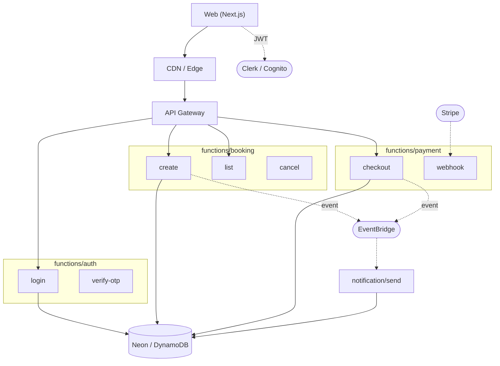

# Profile: serverless

## Quick reference card (read first — 95% of build tasks only need this)

**Functions, not servers. FE on edge CDN + functions as backend. Root `infra/` because IaC is cluster-level.**

```
<slug>/
├── package.json                          ← pnpm workspace
├── pnpm-workspace.yaml                   ← packages: ['apps/*', 'packages/*']
├── pnpm-lock.yaml
├── tsconfig.base.json
├── biome.json
│
├── apps/
│   ├── web/                              ← Next.js / Astro on Vercel/Cloudflare Pages
│   └── api/                              ← function bundle (Hono on Cloudflare Workers default)
│                                         ← may not exist if Next.js Route Handlers cover backend
│
├── packages/                             ← REQUIRED (FE + functions share schema + auth)
│   ├── db/                               ← Drizzle schema (canonical, edge-compatible)
│   ├── auth/                             ← JWT verify + session helpers
│   └── events/                           ← event name + payload schemas (zod)
│
├── docker/                               ← local dev only (DB + Redis for local testing)
│   ├── compose/
│   │   └── docker-compose.dev.yml        ← local Postgres + Redis (mirrors cloud services)
│   ├── environments/
│   └── images/
│
├── scripts/                              ← deploy.sh · health.sh · rollback.sh · smoke.sh
│
└── infra/                                ← IaC at root (NOT Docker — SST/CDK/Terraform)
    ├── <iac-framework>/                  ← SST | CDK | Serverless Framework | SAM | Pulumi | Terraform
    └── environments/                     ← per-env vars (NOT secrets — use platform's secrets store)
```

**Default tech picks:**

| Layer | Default | Alternative |
|---|---|---|
| Frontend host | **Vercel** | Cloudflare Pages / Netlify |
| Function runtime | **Cloudflare Workers (Hono)** | AWS Lambda / Vercel Functions |
| Function framework | **Hono** (4× faster than Fastify on edge) | Vercel Route Handlers / AWS Lambda handlers |
| ORM | **Drizzle** (only edge-compatible TS ORM) | — |
| Database | **Neon Postgres** | PlanetScale / Supabase / Turso / D1 / DynamoDB |
| Auth | **Lucia v3** or **@hono/jwt** | NextAuth (if Next-only) |
| Validation | **Zod** | — |
| IaC | **SST v3** (best DX for AWS Lambda) | CDK / Serverless Framework / SAM / Pulumi / Terraform |
| Frontend framework | **Next.js 16 App Router** | Astro / SvelteKit |
| Tests | **Vitest** + **Playwright** | — |
| Lint+Format | **Biome** | ESLint + Prettier |

---

## Description

Functions, not servers. The frontend deploys to a CDN edge (Vercel /
Cloudflare Pages / Netlify); the backend deploys as independent
functions on AWS Lambda, Cloudflare Workers, or Vercel/Netlify
Functions. Pay per request, scale automatically, stateless by design.
The whole stack lives in one workspace monorepo so the FE and the
functions share types, schemas, and auth helpers. Best fit for spiky
or unpredictable traffic, JAMstack-style web apps, edge-distributed
APIs, or projects where ops cost beats infra cost. Tradeoffs: cold
starts, vendor lock-in, harder local dev, no long-lived connections
(use serverless DB clients with lazy-init pooling).

## Default tech additions

- **Workspace manager:** pnpm (default) | npm workspaces — single lockfile across `apps/*`, `packages/*`
- **Frontend framework:** Next.js (default) | Vite + React | Astro — deployed to Vercel / Cloudflare Pages / Netlify
- **Function platform:** AWS Lambda (default) | Cloudflare Workers | Vercel Functions | Netlify Functions
- **API surface:** AWS API Gateway (default) | Cloudflare Workers router | Vercel Edge | Hono / itty-router (in-function routing)
- **IaC framework:** SST v3 (default) | AWS CDK | Serverless Framework | AWS SAM | Pulumi | Terraform — pick one, root
- **Database:** Neon (Postgres, default) | PlanetScale (MySQL) | Supabase | Turso (SQLite) | Cloudflare D1 | DynamoDB (NoSQL on AWS)
- **ORM / Migration tool:** Drizzle (default — edge-compatible, fast cold start) | Prisma + Data Proxy | Kysely | ElectroDB (DynamoDB) | sqlc
- **Cache / KV:** Upstash Redis (default) | Cloudflare KV | Vercel KV | ElastiCache Serverless — connection-pool-friendly
- **Async events:** EventBridge (default for AWS) | Cloudflare Queues | Vercel Queues | SQS+SNS | Inngest
- **Auth:** Clerk (default) | Auth0 | AWS Cognito | Supabase Auth — managed, not in-house
- **Storage:** S3 | Cloudflare R2 | Vercel Blob — for files, no app-server filesystem
- **Tracing:** OpenTelemetry → Datadog / Honeycomb / AWS X-Ray
- **Local dev:** SST Live | Vercel CLI | Wrangler (Cloudflare) | `docker/compose/docker-compose.dev.yml` for local DB

## Folder structure

```
<slug>/                                   ← project root = pnpm workspace root
├── package.json                          ← workspace deps (eslint, prettier, husky, ts)
├── pnpm-workspace.yaml                   ← packages: ['apps/*', 'packages/*']
├── pnpm-lock.yaml                        ← single shared lockfile
├── tsconfig.base.json
├── eslint.config.mjs
├── .env.example
├── sst.config.ts | serverless.yml | cdk.json   ← root IaC entry (one of these — see "IaC framework" below)
├── README.md
│
├── apps/
│   ├── web/                              ← see "Standard apps/web/ layout" in monolith.md
│   │   ├── src/                          ← app/ + components/ + features/ + lib/ + ...
│   │   ├── public/
│   │   ├── docs/
│   │   ├── test/{unit, e2e}/             ← e2e optional for serverless (edge testing harder)
│   │   ├── next.config.ts | vite.config.ts | astro.config.mjs
│   │   ├── tailwind.config.ts, biome.json, tsconfig.json, package.json
│   │   └── README.md
│   │
│   └── api/                              ★ SERVERLESS FUNCTIONS — one or many deploy units
│       ├── src/
│       │   ├── functions/                ← function handlers grouped by feature
│       │   │   ├── auth/
│       │   │   │   ├── login.ts          ← exported handler
│       │   │   │   ├── verify-otp.ts
│       │   │   │   └── refresh.ts
│       │   │   ├── booking/
│       │   │   │   ├── create.ts
│       │   │   │   ├── list.ts
│       │   │   │   ├── get.ts
│       │   │   │   └── cancel.ts
│       │   │   ├── payment/
│       │   │   │   ├── checkout.ts
│       │   │   │   └── webhook.ts        ← external callbacks (Stripe etc.)
│       │   │   ├── notification/
│       │   │   │   └── send.ts           ← triggered by EventBridge / Queue
│       │   │   └── jobs/
│       │   │       └── cron-reminders.ts ← scheduled function
│       │   ├── middleware/               ← composed before handler runs
│       │   │   ├── with-auth.ts          ← JWT verify + user inject
│       │   │   ├── with-logging.ts
│       │   │   ├── with-validation.ts    ← Zod schema parse
│       │   │   └── compose.ts            ← chain middlewares
│       │   ├── lib/                      ← serverless-aware helpers
│       │   │   ├── db.ts                 ← lazy singleton DB client
│       │   │   ├── kv.ts                 ← lazy singleton KV client
│       │   │   ├── events.ts             ← EventBridge / Queue publisher
│       │   │   └── errors.ts
│       │   └── shared/{constants,types,utils}
│       ├── tests/{unit, integration}
│       ├── package.json                  ← function runtime deps (kept minimal)
│       ├── tsconfig.json
│       └── README.md
│
├── packages/                             ← workspace-shared libraries
│   ├── db/                               ★ SCHEMA + CLIENT — single source of truth
│   │   ├── <orm-folder>/                 ← drizzle/ | prisma/ | database/ (see ORM convention)
│   │   ├── src/
│   │   │   ├── client.ts                 ← exported DB client (used by apps/api/src/lib/db.ts)
│   │   │   └── index.ts
│   │   ├── package.json                  ← name: "@<slug>/db"
│   │   └── README.md
│   ├── auth/                             ← shared JWT + session helpers (used by FE + functions)
│   │   ├── src/
│   │   └── package.json                  ← name: "@<slug>/auth"
│   ├── events/                           ← event names + payload schemas (Zod)
│   │   ├── src/schemas/
│   │   └── package.json                  ← name: "@<slug>/events"
│   ├── types/                            ← shared TS types (DTOs, API contracts)
│   │   └── package.json                  ← name: "@<slug>/types"
│   └── ui/                               ← OPTIONAL — shared FE design system
│       └── package.json
│
├── infra/                                ★ ROOT-LEVEL — IaC + local dev orchestration
│   ├── stacks/                           ← IaC code (organized per concern)
│   │   ├── api.ts                        ← API Gateway + functions
│   │   ├── data.ts                       ← DB (Neon project / DynamoDB tables)
│   │   ├── auth.ts                       ← Cognito / Clerk webhooks
│   │   ├── events.ts                     ← EventBridge bus + rules / Queues
│   │   ├── storage.ts                    ← S3 / R2 buckets
│   │   └── monitoring.ts                 ← log groups, dashboards, alarms
│   ├── compose/
│   │   └── docker-compose.development.yml    ← local-only: Postgres (Neon-compatible) + Redis + LocalStack (optional)
│   ├── docker/                           ← OPTIONAL — for any local-only services
│   │   └── postgres/                     ← if not using cloud-only branches for dev
│   ├── environments/                     ← per-stage config (dev, staging, prod)
│   │   ├── dev.env
│   │   ├── staging.env
│   │   └── prod.env
│   └── scripts/
│       ├── deploy.sh                     ← `sst deploy` / `serverless deploy` wrapper
│       ├── seed.sh                       ← seed dev DB
│       ├── migrate.sh                    ← `drizzle-kit migrate` wrapper
│       └── rollback.sh
│
├── docs/                                 ← project docs (ADRs, runbooks)
└── .github/workflows/                    ← CI: lint, typecheck, test, deploy per stage
```

### IaC framework picks (pick ONE — root config file changes accordingly)

| Framework         | Root file               | Stack folder        | Best for                                   |
|-------------------|-------------------------|---------------------|--------------------------------------------|
| **SST v3** (default) | `sst.config.ts`      | `infra/stacks/*.ts` | TypeScript-native, multi-cloud, live dev   |
| **AWS CDK**       | `cdk.json` + `bin/app.ts` | `infra/stacks/*.ts` | AWS-only, full L3 constructs               |
| **Serverless Framework** | `serverless.yml` (per service) | inline | Quick start, mature ecosystem        |
| **AWS SAM**       | `template.yaml`         | inline              | Pure AWS, CloudFormation-native            |
| **Pulumi**        | `Pulumi.yaml`           | `infra/stacks/*.ts` | Multi-cloud, real programming language     |
| **Terraform**     | `infra/terraform/main.tf` | `infra/terraform/modules/` | Multi-cloud, declarative, mature  |

### Function deploy strategy (pick ONE)

| Strategy              | Layout                                    | Tradeoff                                          |
|-----------------------|-------------------------------------------|---------------------------------------------------|
| **Function-per-route** (default) | one file in `functions/<feature>/<action>.ts` per HTTP route → one Lambda | finer scaling, more cold starts, more deploy units |
| **Function-per-domain** | one Lambda per feature, internal routing via Hono / itty-router | fewer cold starts, simpler ops, less granular scaling |
| **Single mega-function** | one Lambda for the whole API (Hono / Express adapter) | cheapest to operate, monolith-like — closer to picking `monolith.md` |

For Vercel / Next.js Route Handlers, the file IS the route — `app/api/<path>/route.ts`. In that case `apps/api/` is replaced by the route folder inside `apps/web/`, and `apps/api/` may not exist at all.

### ORM folder convention (lives inside `packages/db/`)

Schema is shared between functions and FE (for typed clients), so it
lives in `packages/db/` — NOT inside `apps/api/`.

| ORM             | Folder name (inside `packages/db/`) | Contents                                       |
|-----------------|-------------------------------------|------------------------------------------------|
| **Drizzle** (default) | `drizzle/`                    | `schema.ts` + `migrations/` + `drizzle.config.ts` |
| **Prisma**      | `prisma/`                           | `schema.prisma` + `migrations/` (use Data Proxy / Accelerate for Lambda) |
| **Kysely**      | `database/`                         | `schema.ts` + types (D1-friendly)              |
| **ElectroDB** (DynamoDB) | `database/`                  | entity definitions + access patterns table     |
| **sqlc**        | `db/queries/` + `db/migrations/`    | `.sql` files + generated typed code            |

**Rule:** Drizzle is the recommended default for serverless because it
has zero runtime dependencies, fast cold starts, and works at edge
(Cloudflare Workers, Vercel Edge). Prisma works but requires Data
Proxy / Accelerate to avoid cold-start penalties on Lambda.

### Frontend / backend / shared split rules

1. **`apps/web/`** = frontend deployed to a CDN edge (Vercel / Cloudflare Pages / Netlify).
2. **`apps/api/`** = the function bundle deployed as serverless functions. May not exist if Next.js Route Handlers cover the backend (then API lives inside `apps/web/src/app/api/`).
3. **`packages/db/`** = single source of truth for schema + DB client. Both FE (for typed query results) and functions (for execution) import from it.
4. **`packages/auth/`** = JWT verify + session helpers used by both FE middleware and function `with-auth.ts`.
5. **`packages/events/`** = event names + payload schemas (Zod). Producers and consumers import the same schema.
6. **`infra/`** = IaC at root. Per-app infra (e.g. function-specific config) lives next to the function via decorators / config files.
7. **No app imports from another app's `src/`.** Cross-app code reuse goes through `packages/`.
8. **Folder names role-based, NOT slug-prefixed** — `apps/api/`, NOT `apps/<slug>-api/`.

### Component file organization (frontend) — HARD CONTRACT

Applies to every frontend file under `apps/web/src/` (and to API routes co-located inside Next.js `app/`):

1. **One concern per file.** Pages orchestrate sections only — they do NOT contain section JSX. Split by **logic boundary**:
   ```
   apps/web/src/features/profile/
     ProfilePage.tsx                ← orchestrator only
     components/
       ProfileAvatar.tsx
       ProfilePersonalInfo.tsx
       ProfileUpdatePassword.tsx
       ProfileDeleteAccount.tsx
   apps/web/src/shared/components/header/
     Header.tsx
     HeaderNav.tsx                  ← nav items as JSX inside this file
     HeaderUserMenu.tsx
   apps/web/src/shared/components/footer/
     Footer.tsx
     FooterLinks.tsx
     FooterSocial.tsx
   ```

2. **Component self-containment.** Static UI data (nav items, footer link groups, FAQ rows, dropdown options, social icons) lives **inside the component file that renders it**. Pages NEVER pass static arrays as props.

3. **Translation is the only allowed external dependency.** Components call `t('...')` directly; i18n keys live in locale files.

4. **No `.map()` for static lists.** If the list is fixed at build time, render each item as explicit JSX. `.map()` is reserved for dynamic data fetched via Route Handlers / Server Components / functions.

5. **File size budget.** 50–200 lines per file. Past ~200 → split.

6. **Pages pass dynamic data only** — fetched data, route state, callbacks. Never static UI scaffolding.

7. **Server Components vs Client Components don't change the rule.** Whether a component renders on the edge or in the browser, static data still lives inside it; only dynamic data (props from `<page>.tsx` after `await fetch(...)`) flows in.

### Local dev contract

Serverless local dev is platform-specific. Document the chosen flow in
`apps/api/README.md`:

| Platform           | Local dev tool       | Notes                                              |
|--------------------|----------------------|----------------------------------------------------|
| AWS Lambda + SST   | `pnpm sst dev`       | Live Lambda — local code, real cloud DB           |
| AWS Lambda + SAM   | `sam local start-api`| Full local emulator                                |
| Cloudflare Workers | `wrangler dev`       | Local edge runtime                                 |
| Vercel Functions   | `vercel dev` / `next dev` | Same as production runtime                    |
| Netlify Functions  | `netlify dev`        | Local emulator                                     |

Local DB:
- Neon / PlanetScale / Supabase: use cloud branching for dev (preferred — closer to prod)
- DynamoDB: `dynamodb-local` via `infra/compose/docker-compose.development.yml`
- D1 / Turso: `wrangler d1 execute --local` / `turso dev`

## Database approach

**Serverless-native DB. NoSQL preferred OR connection-pool-friendly SQL.**

- **Default: Neon** (Postgres) — branching for preview deploys, serverless connection pooler, edge-compatible. Drizzle as the ORM.
- **DynamoDB** for high-scale, simple-access-pattern AWS workloads — single-table design, GSIs designed for the access patterns you've already enumerated.
- **PlanetScale** (MySQL) — connection pooler built in, branching, schema diff-based migrations.
- **Cloudflare D1 / Turso** — SQLite at the edge, sub-ms reads, replicas for global distribution.
- **Supabase** — Postgres + Auth + Realtime + Storage if you want managed everything.
- **Avoid:** traditional Postgres on a single instance — connection storms during traffic spikes will exhaust max_connections. If you must use it, put pgBouncer / Supabase Pooler / RDS Proxy in front.
- **DB client:** lazy-init singleton in `packages/db/src/client.ts`. **Module-scope, not function-scope** — Lambda warm starts reuse the connection.
- **Schema migrations:**
  - SQL DBs: tool depends on ORM (Drizzle Kit / Prisma Migrate / Atlas) — run via `scripts/migrate.sh` in CI before deploy.
  - DynamoDB: declared in IaC (`infra/stacks/data.ts`) — table changes deploy via CDK / SST / SAM.
- **Cross-function references:** store IDs, NOT relations. Each function owns its access patterns.
- **DynamoDB-specific:** read patterns design FIRST, schema follows — DynamoDB is access-pattern-driven. Document partition key / sort key / GSI choices in `packages/db/README.md`.

## Communication style

**Functions don't call each other directly. They emit events.**

- **Sync within a request:** one function handles end-to-end. Don't fan out to other functions for sync work — use shared modules in `packages/` instead.
- **Async events:** publish to EventBridge / SQS+SNS / Cloudflare Queues / Inngest. Other functions subscribe via IaC-declared rules.
- **External callbacks:** dedicated webhook function (`functions/payment/webhook.ts`) parses provider callbacks, validates signature, and emits internal events.
- **Boundary discipline:** strict — each function has minimal runtime deps, no shared global state, no warm-state assumptions beyond connection pooling.
- **Auth:** every function passes through `with-auth` middleware which validates JWT via `@<slug>/auth`. Public functions opt out explicitly.
- **Validation:** every function passes through `with-validation` middleware with a Zod schema from `@<slug>/events` or local schema file.
- **Frontend → Backend:** typed HTTP client in `apps/web/src/shared/lib/api.ts` consuming types from `@<slug>/db` (query results) and `@<slug>/types` (DTOs).

```ts
// apps/api/src/functions/booking/create.ts
import { compose } from '../../middleware/compose';
import { withAuth } from '../../middleware/with-auth';
import { withValidation } from '../../middleware/with-validation';
import { db } from '../../lib/db';                 // lazy singleton
import { events } from '../../lib/events';
import { CreateBookingSchema } from '@<slug>/events/booking';

export const handler = compose(
  withAuth,
  withValidation(CreateBookingSchema),
)(async (event, ctx) => {
  const booking = await db.insert(bookings).values({
    ...event.body,
    userId: ctx.user.id,
  }).returning();

  await events.publish('booking.created', { bookingId: booking.id, userId: ctx.user.id });

  return { statusCode: 200, body: JSON.stringify(booking) };
});
```

## Mermaid diagram patterns

### System architecture diagram

API Gateway as the entry point, fanning out to function nodes. Each
function is a small box. Group functions by feature using subgraphs
(Auth / Booking / Payment / Notification). Show the event bus
(EventBridge / Queue) as a horizontal bus with dashed orange arrows
(`linkStyle ... stroke-dasharray:6 4`). DB shown as a cylinder node
that ALL functions reach via the shared lazy client. S3 / object
storage as separate cylinder. Auth provider (Clerk / Cognito) shown
as an external node.



### Database diagram

- **For SQL serverless DBs (Neon / PlanetScale / Supabase / D1 / Turso):** regular `erDiagram` works. All entities together, FKs allowed inside the same DB.
- **For DynamoDB:** NOT an `erDiagram` (relations don't fit). Use a TABLE showing entities, partition keys, sort keys, GSIs, and access patterns mapped to each.

### Infrastructure diagram

API Gateway in front. Functions grouped by feature subgraph. Event bus
as a horizontal element. DB cylinder. KV (Redis / Upstash) cylinder.
S3 / R2 cylinder. Auth provider as a separate external node. CDN edge
in front of the FE. Distinct `classDef` colors per layer (CDN /
Gateway / Functions / Data / Events / Storage / External). No
"servers" — use lambda-shaped nodes (or just function-shaped nodes) to
make the serverless nature visible.
