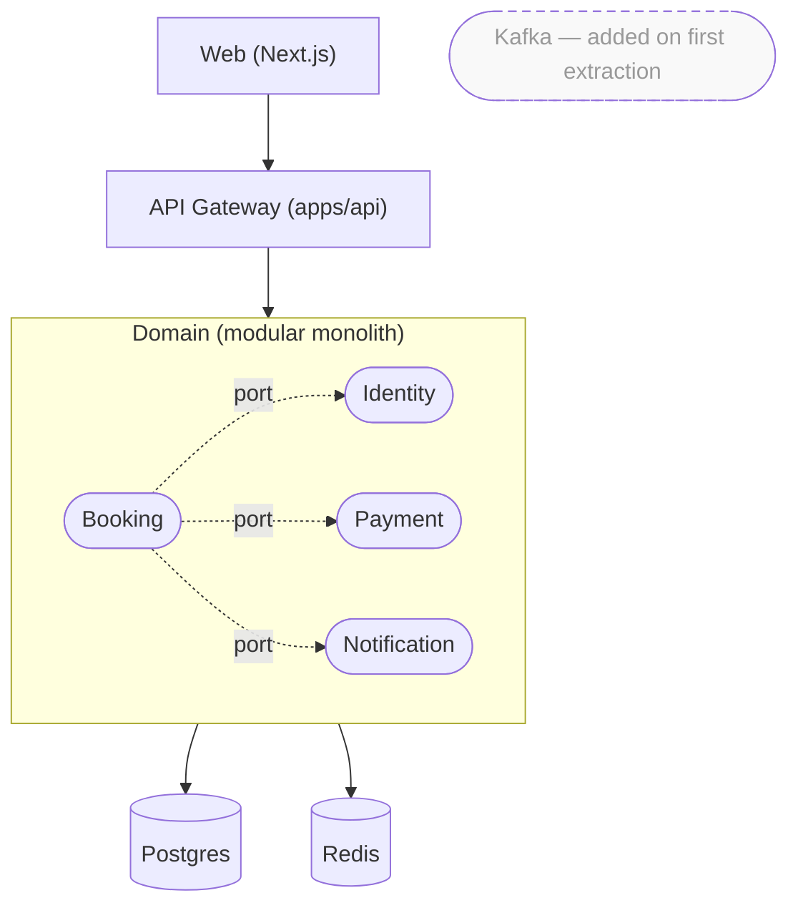

# Profile: hybrid

## Description

A modular monolith with extraction-ready boundaries — and an empty
`services/` slot at the workspace root for the day one or two modules
get lifted out. Today you ship the backend as a single deploy
(`apps/api/`), one database, fast iteration. Tomorrow when one module
gets too busy or too complex, you extract it into `services/<name>/`
with its own deploy and DB — without rewriting business logic, because
every module already talks through interface ports and references other
modules by ID only. Best fit for ~70% of real projects: teams who say
"we want microservices eventually" but shouldn't pay distributed-systems
cost yet. Speed of monolith now, optionality for later.

## Default tech additions

- **Workspace manager:** pnpm (default) | npm workspaces | yarn workspaces — single lockfile across `apps/*`, `services/*`, `packages/*`
- **Frontend framework:** Next.js (default) | Vite + React — talks to the monolith API, plus directly to any extracted services
- **Backend framework:** NestJS (default) | Express + tRPC | Fastify — same single process serves the monolith
- **Database:** Postgres — single instance for the monolith core, separate instance per extracted service
- **ORM / Migration tool:** Prisma (default) | Drizzle | TypeORM | Kysely — monolith uses one schema, extracted services own their own
- **Cache:** Redis (recommended) — used through a shared port so it's swappable
- **Job queue:** BullMQ on Redis (recommended) — same Redis used for cache
- **Events:** in-process EventEmitter today (with event names + schemas matching future Kafka topics) — Kafka added when first service is extracted
- **API gateway:** none initially — gets added in `infra/gateway/` when the first service is extracted
- **Service mesh:** none initially — added if 3+ services exist

## Folder structure

```
<slug>/                                   ← project root = pnpm workspace root
├── package.json                          ← workspace deps (eslint, prettier, husky, ts)
├── pnpm-workspace.yaml                   ← packages: ['apps/*', 'services/*', 'packages/*']
├── pnpm-lock.yaml                        ← single shared lockfile
├── tsconfig.base.json
├── eslint.config.mjs
├── .env.example
├── README.md
│
├── apps/
│   ├── web/                              ← frontend (Next.js / Vite-React)
│   │   ├── src/
│   │   │   ├── app/                      ← App.tsx + router.tsx (or Next app/)
│   │   │   ├── features/                 ← feature-sliced UI
│   │   │   ├── layouts/
│   │   │   ├── shared/{components,constants,hooks,lib,types}
│   │   │   ├── styles/
│   │   │   └── main.tsx
│   │   ├── public/
│   │   ├── e2e/                          ← Playwright
│   │   ├── tests/                        ← unit (Vitest)
│   │   ├── package.json, Dockerfile, vite.config.ts | next.config.ts
│   │   └── README.md
│   │
│   └── api/                              ★ MODULAR MONOLITH — single backend deploy today
│       ├── src/
│       │   ├── bootstrap/                ← DI container, retry, timeout, app composition
│       │   ├── compose-root.ts           ★ SINGLE wiring point — swap implementations to extract
│       │   ├── configs/
│       │   ├── database/                 ← ORM client, migration runner
│       │   ├── events/                   ← in-process EventEmitter today; Kafka producer wrappers tomorrow
│       │   ├── modules/                  ← MODULAR services — extraction-ready boundaries
│       │   │   ├── identity/
│       │   │   │   ├── port.ts           ★ INTERFACE — the extraction contract
│       │   │   │   ├── handlers.ts       ← HTTP handlers
│       │   │   │   ├── service.ts        ← business logic
│       │   │   │   ├── repository.ts     ← DB access
│       │   │   │   ├── events.ts         ← event names + payload schemas (Kafka-shaped)
│       │   │   │   ├── adapters/         ← in-process adapter today; gRPC client tomorrow
│       │   │   │   │   ├── local.ts      ← imports service.ts directly
│       │   │   │   │   └── remote.ts     ← gRPC client (added at extraction time)
│       │   │   │   └── tests/
│       │   │   ├── booking/              ← same shape
│       │   │   ├── payment/              ← same shape
│       │   │   └── notification/         ← same shape
│       │   ├── routes/                   ← single HTTP gateway: routes.ts wires modules to URLs
│       │   ├── shared/{constants,errors,middlewares,plugins,types,utils}
│       │   └── server.ts                 ← single entry point
│       ├── <orm-folder>/                 ← prisma/ | drizzle/ | database/ (see ORM convention)
│       ├── tests/{unit, integration}
│       ├── package.json
│       ├── Dockerfile                    ← ONE container today
│       ├── tsconfig.json
│       └── README.md
│
├── services/                             ★ EMPTY UNTIL FIRST EXTRACTION
│   └── (when a module is extracted, it moves here following microservices.md layout —
│       services/<name>/{src, <orm-folder>, proto, kubernetes, helm, Dockerfile, package.json, README.md})
│
├── packages/                             ← shared workspace libraries
│   ├── ports/                            ★ EXTRACTION CONTRACTS — interfaces shared by api + future services
│   │   ├── identity.ts                   ← IdentityPort interface
│   │   ├── booking.ts
│   │   └── package.json                  ← name: "@<slug>/ports"
│   ├── events/                           ← Kafka-shaped event schemas (in-process today, Kafka tomorrow)
│   │   ├── schemas/
│   │   │   ├── booking-created.ts
│   │   │   └── payment-completed.ts
│   │   └── package.json                  ← name: "@<slug>/events"
│   ├── proto/                            ← OPTIONAL — gRPC contracts (added when first service extracted)
│   │   └── package.json
│   ├── types/                            ← OPTIONAL — shared TS types not in proto/ports
│   │   └── package.json
│   └── ui/                               ← OPTIONAL — shared FE design system
│       └── package.json
│
├── infra/                                ★ ROOT-LEVEL — shared by all apps + services
│   ├── compose/
│   │   ├── docker-compose.development.yml    ← FE + monolith + DB/Redis + (extracted services if any)
│   │   ├── docker-compose.staging.yml
│   │   ├── docker-compose.production.yml     ← prod uses managed DB, only app images
│   │   └── docker-compose.images.yml
│   ├── docker/
│   │   ├── postgres/                     ← Dockerfile + init/ (DEV ONLY)
│   │   ├── redis/                        ← Dockerfile + redis.conf
│   │   ├── kafka/                        ★ EMPTY UNTIL FIRST EXTRACTION (or when async events go cross-process)
│   │   ├── rabbitmq/                     ← optional alternative to Kafka
│   │   └── nginx/                        ← reverse proxy in front of api (optional)
│   ├── gateway/                          ★ EMPTY UNTIL FIRST EXTRACTION
│   │   └── (Kong / Traefik config added when traffic needs to fan out to multiple services)
│   ├── kubernetes/                       ← cluster-wide manifests (when deploying to K8s)
│   ├── observability/
│   │   ├── prometheus/                   ← scrape configs
│   │   ├── grafana/                      ← dashboards
│   │   └── otel-collector.yaml           ← traces ready for distributed mode
│   ├── environments/
│   │   ├── api.env
│   │   ├── postgres.env
│   │   └── redis.env
│   └── scripts/
│       ├── deploy.sh
│       ├── extract-service.sh            ★ HYBRID-SPECIFIC — automates lifting a module to services/
│       ├── health.sh
│       └── rollback.sh
│
├── docs/
│   ├── ADR-0001-modular-monolith.md
│   └── extraction-playbook.md            ★ HYBRID-SPECIFIC — when + how to extract a module
└── .github/workflows/
```

### ORM folder convention (same as monolith — applied per app/service)

| Language + ORM         | Folder name           | Contents                                   |
|------------------------|-----------------------|--------------------------------------------|
| Node + **Prisma**      | `prisma/`             | `schema.prisma` + `migrations/` + `seed.ts`|
| Node + **Drizzle**     | `drizzle/`            | `schema.ts` + `migrations/`                |
| Node + **TypeORM**     | `database/`           | `entities/` + `migrations/`                |
| Node + **Sequelize**   | `database/`           | `models/` + `migrations/` + `seeders/`     |
| Node + **Kysely**      | `database/`           | `schema.ts` + `migrations/`                |
| Go + sqlc / GORM       | `db/queries/` or `database/` | per Go convention                  |
| Python + SQLAlchemy + Alembic | `database/` + `alembic/` | models + migration scripts        |

**Rule:** `apps/api/` follows its chosen ORM. When a module is
extracted to `services/<name>/`, that service picks its own ORM (it
doesn't have to match the monolith's).

### Frontend / backend / extraction split rules

1. **`apps/web/`** = frontend (same shape as monolith profile).
2. **`apps/api/`** = the modular monolith — ONE backend deploy holding all modules today.
3. **`apps/api/src/modules/<svc>/`** = a single module — ALWAYS contains `port.ts`, `service.ts`, `repository.ts`, `events.ts`, plus `adapters/local.ts` (and `adapters/remote.ts` once extracted).
4. **`services/`** = empty at the start. When a module is extracted, it moves here following the microservices layout (own DB, own Dockerfile, own k8s manifests). The monolith then imports `adapters/remote.ts` instead of `adapters/local.ts` for that module — `compose-root.ts` is the single line that changes.
5. **`packages/ports/`** = the extraction contracts. Both `apps/api/` and any future `services/<name>/` import the same `IdentityPort` interface. This is what makes extraction mechanical.
6. **Folder names role-based, NOT slug-prefixed** — `apps/api/`, `services/booking/`, NOT `apps/<slug>-api/`.

### Extraction recipe (the hybrid promise)

When a module is ready to extract (typical signals: scaling pressure,
team ownership boundary, deploy cadence mismatch):

1. **Move** `apps/api/src/modules/<svc>/` → `services/<svc>/src/modules/<svc>/`.
2. **Add** `services/<svc>/Dockerfile`, `services/<svc>/<orm-folder>/`, `services/<svc>/package.json`, `services/<svc>/kubernetes/`.
3. **Add** `services/<svc>/proto/<svc>.proto` and run protobuf codegen — generated client lands in `packages/proto/`.
4. **Migrate** that module's tables out of the monolith DB into the new service's own DB (data migration script in `infra/scripts/`).
5. **Switch** `apps/api/src/compose-root.ts` from `adapters/local.ts` to `adapters/remote.ts` (gRPC client) for the extracted module.
6. **Add** `infra/gateway/` (Kong / Traefik) if not already present, route `/api/<svc>/*` to the new service.
7. **Update** `infra/compose/docker-compose.development.yml` to include the new service.
8. The monolith continues serving the other modules. Frontend may continue calling the monolith for the extracted module (gateway transparently routes), or be updated to call the gateway directly.

This is mechanical because **the interface (`port.ts`) didn't change**.
The extraction playbook lives in `docs/extraction-playbook.md`.

## Database approach

**Single Postgres instance for the monolith, BUT with strict
per-module ownership.** All tables in one schema (whatever the chosen
ORM calls it), but each module owns its own tables and other modules
reference them by ID only — **no foreign keys across module
boundaries.**

- **Tool:** chosen ORM from SoW Phase 6 — defaults to Prisma
- **Tables grouped by module** in the schema file with section comment headers (e.g. `// === booking ===`)
- **Cross-module references:** store the foreign ID as a column but DON'T add a `@relation` decorator (Prisma) or matching foreign key constraint (any ORM). The relation lives at the application layer, not the DB layer.
- **No cross-module SQL JOINs** — modules that need other modules' data go through the port (`identityPort.getUser(id)`).
- **One linear migration history** for the monolith DB.
- **Dev DB:** dockerized via `infra/docker/postgres/`
- **Prod DB:** managed service (Supabase / RDS / Neon)
- **When you extract a module:** its tables move to a new DB without breaking anything because no other module had FK constraints pointing at them.
- **No cross-module JOINs are written today**, so extraction is mechanical not creative.

## Communication style

**Through interface ports, never direct imports of other modules'
internals.**

```ts
// apps/api/src/modules/booking/handlers.ts
import type { NotificationPort, IdentityPort } from '@<slug>/ports';

export async function createBooking(
  input: CreateBookingInput,
  deps: { notify: NotificationPort; identity: IdentityPort }
) {
  const user = await deps.identity.getUser(input.userId);   // through port
  const booking = await db.bookings.insert(input);
  await deps.notify.send(input.userId, 'booked');           // through port
  return booking;
}

// apps/api/src/compose-root.ts (single composition point)
import { localNotify } from './modules/notification/adapters/local';     // today: in-process
// import { remoteNotify } from './modules/notification/adapters/remote'; // tomorrow: gRPC, just swap
import { localIdentity } from './modules/identity/adapters/local';

const deps = {
  notify: localNotify,
  identity: localIdentity,
};
```

- **Sync:** through interface (`port.ts`) — implementation injected at composition root
- **Async:** in-process EventEmitter today, but **event names match what Kafka topics would be later** (`booking.created`, `payment.completed`)
- **Boundary discipline:** STRICT — no module imports another module's internal files. Lint rule (eslint-plugin-boundaries) enforces this.
- **Frontend → Backend:** typed HTTP client in `apps/web/src/shared/lib/api.ts`. No direct calls to module internals — only to public routes registered in `apps/api/src/routes/`.
- **The phrase:** "you probably won't extract them, but if you do, you can."

## Mermaid diagram patterns

### System architecture diagram

Outer subgraph per layer (Client / API / Domain / Data / Infrastructure
/ External). Inside Domain, each module is a separate node with
**rounded edges and dotted internal arrows** to suggest "could become
independent." Show `port.ts` as a labeled boundary on each module
edge. External nodes (broker, mesh) shown grayed-out / dashed because
they're not deployed yet but the contract for them is there.



### Database diagram

Single `erDiagram` block, but entities are grouped by module via
section comments. **No `||--o{` lines crossing module boundaries** —
only ID references annotated as `# ref→users.id (module: identity)`.
This visually enforces the no-cross-module-FK rule.

### Infrastructure diagram

Same as monolith for now (one web + one API + one Postgres + Redis +
external integrations) but with a **callout block**:

> **Migration path:** each module in `apps/api/src/modules/<name>/` can
> be lifted to `services/<name>/` for independent deploy when scale
> demands. See `docs/extraction-playbook.md` for the recipe.
> Cross-module communication uses ports today (in-process), gRPC after
> extraction. `infra/gateway/` and `infra/docker/kafka/` activate at
> first extraction.
