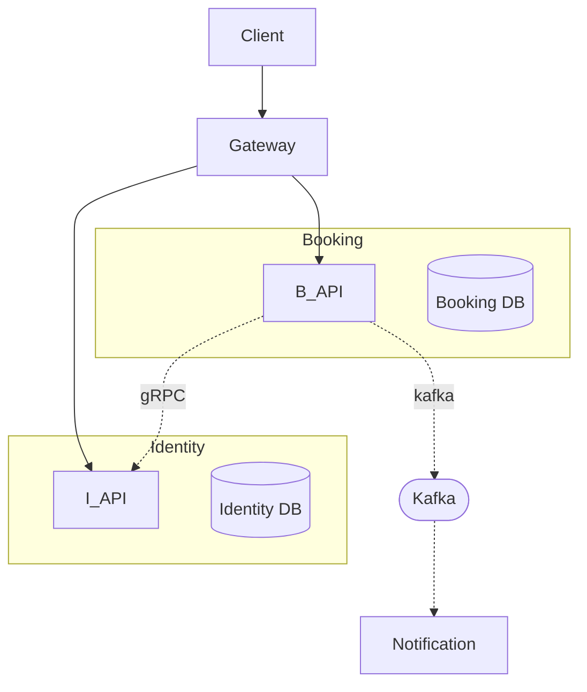

# Profile: microservices

## Description

Independent services. Each has its own deploy, its own database, its own
lifecycle, its own scaling style. They communicate over the network
via gRPC for sync calls and Kafka for async events. Best fit for large
projects with multiple teams owning different services, services with
genuinely different scaling needs (e.g. media processing vs auth), or
domains where independent release cadence is critical. Cost: real
distributed-systems pain — eventual consistency, network failures,
service mesh complexity.

## Default tech additions

- **Backend framework:** NestJS (default) | Go | Python FastAPI — pick per service
- **Service mesh:** Istio (default) | Linkerd | none — service-to-service security + observability
- **API gateway:** Kong (default) | Traefik | nginx | AWS API Gateway — public traffic entry
- **Message broker:** **Kafka (default, REQUIRED)** | RabbitMQ — async events, must be present
- **Cache:** **Redis cluster (REQUIRED)** — distributed cache, sessions, rate limiting
- **Database per service:** Postgres (default) | MongoDB | per-service choice — separate instances
- **Tracing:** OpenTelemetry → Jaeger / Tempo — distributed tracing across service boundaries
- **Container orchestration:** Kubernetes (default) | Nomad | Docker Swarm — deployment platform
- **Service discovery:** Kubernetes-native | Consul

## Folder structure

```
<project-root>/
├── services/
│   ├── identity/                   # each service is its own folder
│   │   ├── src/
│   │   ├── prisma/
│   │   │   └── schema.prisma       # OWN database schema
│   │   ├── proto/
│   │   │   └── identity.proto      # gRPC contract
│   │   ├── package.json            # OWN package
│   │   ├── Dockerfile              # OWN container image
│   │   ├── kubernetes/
│   │   │   ├── deployment.yaml
│   │   │   ├── service.yaml
│   │   │   └── ingress.yaml
│   │   ├── helm/                   # optional Helm chart
│   │   └── README.md
│   ├── booking/                    # same shape
│   │   └── (own everything)
│   ├── payment/
│   │   └── (own everything)
│   ├── notification/
│   │   └── (own everything)
│   └── gateway/                    # API gateway in front
│       ├── kong/
│       └── routes.yaml
├── packages/
│   ├── proto/                      # shared protobuf contracts
│   │   ├── common.proto
│   │   ├── identity.proto
│   │   └── booking.proto
│   └── events/                     # shared Kafka topic schemas
│       └── schemas/
├── infrastructure/
│   ├── kafka/                      # broker config
│   │   ├── topics.yaml
│   │   └── docker-compose.yml
│   ├── redis/                      # cache cluster config
│   ├── postgres/                   # per-service DB instance configs
│   │   ├── identity-db.yaml
│   │   ├── booking-db.yaml
│   │   └── payment-db.yaml
│   └── observability/
│       ├── jaeger.yaml
│       └── prometheus.yaml
├── docker-compose.yml              # local dev orchestration (all services)
├── kubernetes/
│   └── (cluster-wide manifests)
└── README.md
```

## Database approach

**Strict DB per service. No exceptions.**

- Each service has its own Postgres instance (or DB on a shared cluster but logically isolated).
- Cross-service references stored as IDs only — `booking.customer_id` is just a UUID, not a `@relation` to identity-service's `users` table.
- Cross-service data fetched via API call (gRPC) or Kafka event consumption.
- Each service has its own migration history (`prisma/migrations/`).
- Schema changes never coordinate across services — each can deploy independently.
- Tool: Prisma per service (or whatever each service prefers — services don't need to agree)
- Anti-pattern alert: "shared DB with separate schemas" looks tempting but defeats the purpose. Don't do it.

## Communication style

**Network-only. No direct imports between services.**

- **Sync calls:** gRPC (with protobuf contracts in `packages/proto/`). REST allowed for public API gateway only.
- **Async events:** Kafka. Every meaningful state change publishes an event with schema in `packages/events/schemas/`.
- **Boundary discipline:** strict — services share NOTHING except the contract files in `packages/`. No shared business logic, no shared types beyond protobuf.
- **Service-to-service auth:** mTLS via service mesh OR JWT-with-service-claims.
- **Backpressure / retries:** built into clients (gRPC retry policy, Kafka consumer commit semantics).

```ts
// services/booking/handlers.ts
import { identityClient } from './grpc-clients';
import { kafka } from './kafka-client';

export async function createBooking(input) {
  const user = await identityClient.getUser({ id: input.userId });   // gRPC call
  const booking = await db.bookings.insert(input);
  await kafka.publish('booking.created', { bookingId: booking.id, userId: input.userId });
  return booking;
}
```

## Mermaid diagram patterns

### System architecture diagram

Each service in its own subgraph. Network arrows between subgraphs (NOT
inside). Gateway node out front. Kafka shown as a horizontal "event bus"
crossing the bottom with dashed orange arrows (`linkStyle ... stroke-dasharray:6 4`)
to/from each service.



### Database diagram

Multiple `erDiagram` blocks — one per service — separated by `<h2>Service: <name></h2>` headings.
Or single block with strong visual grouping (named subgraphs / labeled comments). NO `||--o{{`
lines crossing service boundaries. Cross-service refs annotated as `# ref→users.id (in identity-service DB)`.

### Infrastructure diagram

Per-service nodes in subgraphs. Kafka cluster, Redis cluster, gateway,
service mesh control plane all visible as separate nodes. Distinct
`classDef` colors per layer (services / data / infra / external).
