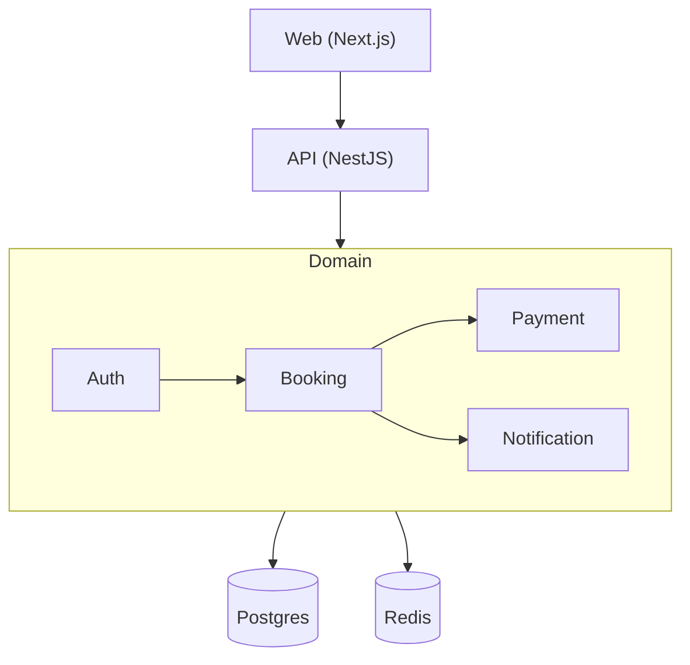

# Profile: monolith

## Description

One product, one team, one repo. Frontend and backend live as separate
**workspace members** under `apps/`, sharing a single lockfile, root
tooling (eslint, prettier, ts), and infrastructure config. The backend
itself is monolithic — one API process, one database, modules import
each other freely. Best fit for small-to-medium products with a single
team where speed-to-market beats distributed-system flexibility, and
where shared TypeScript types between FE and BE prevent contract drift.
Easy to refactor inside; harder to scale horizontally per-feature, but
most projects never need that.

## Default tech additions

- **Workspace manager:** pnpm (default) | npm workspaces | yarn workspaces — single lockfile across all apps
- **Backend framework:** NestJS (default) | Express | Fastify — REST API in a single process
- **Frontend framework:** Next.js (default) | Vite + React | Nuxt — SSR or SPA
- **Database:** Postgres (default) | MySQL — single instance, all schemas
- **ORM / Migration tool:** Prisma (default) | Drizzle | TypeORM | Kysely | Sequelize — single schema, linear migration history
- **Cache:** Redis (optional) — sessions, rate limiting, hot reads
- **Job queue:** BullMQ on Redis (optional) | in-process cron — background work
- **Events:** in-process EventEmitter (default) | Node Worker Threads — no broker needed for monolith
- **API gateway:** none (single API surface) | nginx reverse proxy if FE + BE deploy together

## Folder structure

```
<slug>/                                   ← project root = pnpm workspace root
├── package.json                          ← workspace deps (eslint, prettier, husky, ts)
├── pnpm-workspace.yaml                   ← packages: ['apps/*']
├── pnpm-lock.yaml                        ← single shared lockfile
├── tsconfig.base.json                    ← shared TS config extended by apps
├── eslint.config.mjs                     ← shared lint config
├── .prettierrc, .editorconfig, .gitignore
├── .env.example                          ← root-level shared vars
├── README.md
│
├── apps/
│   ├── api/                              ← backend monolith (NestJS / Express / Fastify)
│   │   ├── src/
│   │   │   ├── bootstrap/                ← DI container, retry, timeout, app composition
│   │   │   ├── configs/                  ← env loaders, app config
│   │   │   ├── database/                 ← ORM client, migration runner (see "ORM folder" below)
│   │   │   ├── events/                   ← in-process EventEmitter / queue handlers
│   │   │   ├── modules/                  ← domain modules (NO -module suffix)
│   │   │   │   ├── auth/
│   │   │   │   ├── booking/
│   │   │   │   ├── payment/
│   │   │   │   └── notification/
│   │   │   ├── routes/                   ← HTTP route registration
│   │   │   ├── shared/{constants,errors,middlewares,plugins,types,utils}
│   │   │   └── server.ts                 ← single entry point
│   │   ├── <orm-folder>/                 ← see "ORM folder convention" below
│   │   ├── tests/{unit, integration}
│   │   ├── package.json
│   │   ├── Dockerfile                    ← app's own image
│   │   ├── tsconfig.json                 ← extends ../../tsconfig.base.json
│   │   └── README.md
│   │
│   ├── web/                              ← frontend (Next.js / Vite-React / Nuxt)
│   │   ├── src/
│   │   │   ├── app/                      ← App.tsx + router.tsx (or Next app/ dir)
│   │   │   ├── features/                 ← feature-sliced UI (booking, auth, ...)
│   │   │   ├── layouts/
│   │   │   ├── shared/{components,constants,hooks,lib,types}
│   │   │   ├── styles/                   ← global CSS / Tailwind config
│   │   │   └── main.tsx                  ← or pages/_app.tsx for Next
│   │   ├── public/                       ← static assets
│   │   ├── e2e/                          ← Playwright
│   │   ├── tests/                        ← unit (Vitest / Jest)
│   │   ├── package.json
│   │   ├── Dockerfile                    ← multi-stage: build + nginx serve
│   │   ├── nginx.conf                    ← FE-specific (serves SPA build artifacts)
│   │   ├── vite.config.ts | next.config.ts
│   │   ├── tsconfig.json                 ← extends ../../tsconfig.base.json
│   │   └── README.md
│   │
│   └── shared/                           ← OPTIONAL — DTOs, API contracts, enums
│       ├── types/                        ← imported by both api + web
│       ├── constants/
│       └── package.json                  ← name: "@<slug>/shared"
│
├── infra/                                ★ ROOT-LEVEL — shared by all apps
│   ├── compose/
│   │   ├── docker-compose.development.yml    ← FE + BE + dockerized DB/Redis
│   │   ├── docker-compose.staging.yml
│   │   ├── docker-compose.production.yml     ← uses managed DB (Supabase/RDS), only app images
│   │   └── docker-compose.images.yml         ← prebuilt images for CI/registry
│   ├── docker/
│   │   ├── postgres/                     ← Dockerfile + init/ + postgres.conf  (DEV ONLY)
│   │   ├── redis/                        ← Dockerfile + redis.conf
│   │   ├── rabbitmq/                     ← (optional)
│   │   ├── kafka/                        ← (optional)
│   │   └── nginx/                        ← reverse proxy in front of api (NOT the FE nginx)
│   ├── environments/                     ← per-service env files
│   │   ├── postgres.env
│   │   ├── redis.env
│   │   └── *.env
│   └── scripts/
│       ├── deploy.sh
│       ├── health.sh
│       └── rollback.sh
│
├── docs/                                 ← project docs (ADRs, runbooks)
└── .github/workflows/                    ← CI: lint, typecheck, test, build, deploy
```

### ORM folder convention

The `<orm-folder>` inside `apps/api/` adapts to the chosen ORM. Respect
each ORM's own CLI conventions — fighting the tool is not worth it.

| ORM         | Folder name   | Contents                                              |
|-------------|---------------|-------------------------------------------------------|
| **Prisma**  | `prisma/`     | `schema.prisma` + `migrations/` + `seed.ts`           |
| **Drizzle** | `drizzle/`    | `schema.ts` + `migrations/` + `drizzle.config.ts`     |
| **TypeORM** | `database/`   | `entities/` + `migrations/` + `data-source.ts`        |
| **Sequelize** | `database/` | `models/` + `migrations/` + `seeders/` + `config/`    |
| **Kysely**  | `database/`   | `schema.ts` + `migrations/` + types                   |
| **MikroORM** | `database/`  | `entities/` + `migrations/` + `mikro-orm.config.ts`   |

**Rule:** if the ORM ships a CLI that expects a specific folder
(Prisma, Drizzle), use that folder name. Otherwise use the generic
`database/` folder. The build engine reads the selected ORM from SoW
Phase 6 and lays out the right folder accordingly.

### Frontend / backend split rules

1. **Always split FE and BE** at `apps/` level, even though backend is monolithic. One combined folder is forbidden.
2. **Folder names are role-based, NOT slug-prefixed** — `apps/api/`, `apps/web/`, NOT `apps/<slug>-api/`. The slug is already the workspace root name.
3. **Each app has its own** `package.json`, `Dockerfile`, `tsconfig.json` (extending root base), `tests/`, `README.md`.
4. **Workspace root owns shared concerns** — eslint, prettier, husky, ts, lockfile, root `.env.example`, `infra/`.
5. **`apps/shared/` is optional** — create it only if FE + BE share TypeScript types (DTOs, enums). For non-TS stacks, skip.

### Component file organization (frontend) — HARD CONTRACT

These rules apply to every frontend file under `apps/web/src/`:

1. **One concern per file.** Pages orchestrate sections only — they do NOT contain section JSX. Split each page by **logic boundary**:
   ```
   apps/web/src/features/profile/
     ProfilePage.tsx                ← orchestrator only (composes children)
     components/
       ProfileAvatar.tsx
       ProfilePersonalInfo.tsx
       ProfileUpdatePassword.tsx
       ProfileDeleteAccount.tsx
   apps/web/src/shared/components/header/
     Header.tsx                     ← container
     HeaderLogo.tsx
     HeaderNav.tsx                  ← nav items live INSIDE this file as JSX, not as a prop array
     HeaderLanguageSwitcher.tsx
     HeaderUserMenu.tsx
   apps/web/src/shared/components/footer/
     Footer.tsx
     FooterLinks.tsx                ← link groups live INSIDE this file
     FooterSocial.tsx
     FooterNewsletter.tsx
   ```

2. **Component self-containment.** Static UI data (nav items, footer links, FAQ rows, dropdown options, social icons, hero feature lists, language list) lives **inside the component file that renders it**. Pages NEVER pass static arrays as props.

3. **Translation is the only allowed external dependency.** Components call `t('header.nav.home')` directly. i18n keys live in locale files, not in prop arrays.

4. **No `.map()` for static lists.** If the list is fixed at build time, render each `<li>` / `<NavLink>` / `<FaqItem>` directly as JSX. `.map()` is reserved for dynamic data from API/DB/store.

5. **File size budget.** 50–200 lines per component file. Past ~200 lines or two unrelated logic concerns → split immediately.

6. **Dynamic data only flows via props.** Pages may pass: the authenticated user, fetched API/DB content, route state, callbacks. Pages may NOT pass: static UI scaffolding.

**Anti-pattern (FAIL):** `<Header items={navItems} />` where `navItems` is `[{href:'/',label:'Home'}, ...]` defined in the page or a `data.ts`.
**Correct:** `<Header />` and `HeaderNav.tsx` contains explicit JSX `<NavLink to="/">{t('header.nav.home')}</NavLink>` per item.

### nginx clarification (two roles, two locations)

| Role | Location | Purpose |
|---|---|---|
| **Reverse proxy** in front of API | `infra/docker/nginx/` | TLS termination, rate limit, route `/api/*` → api:3000, `/*` → web:80 |
| **SPA static server** for FE | `apps/web/nginx.conf` | Serves `apps/web/dist/` build artifacts inside the web Dockerfile |

Drop `infra/docker/nginx/` if you deploy behind a managed LB
(Cloudflare, Vercel, AWS ALB) or if Next.js serves both UI and API
routes directly.

## Database approach

**Single Postgres instance.** All tables in one schema (whatever the
ORM calls it — `schema.prisma`, `schema.ts`, `entities/`). Foreign keys
allowed across modules (`booking.user_id → users.id` is fine). Modules
can JOIN across each other's tables when needed. Migrations are a
single linear history.

- **Tool:** chosen ORM from SoW Phase 6 — defaults to Prisma
- **Cross-module data:** direct SQL JOINs allowed
- **Schema ownership:** shared — all modules can read each other's tables
- **Dev DB:** dockerized via `infra/docker/postgres/`
- **Prod DB:** managed service (Supabase / RDS / Neon) — `infra/docker/postgres/` is DEV ONLY
- **Caveat:** as the project grows, expect to add module-scoped folders inside the ORM directory (e.g. `prisma/auth/`, `prisma/booking/`) but the DB stays one

## Communication style

**Direct in-process function calls.** Modules import each other's
service files directly:

```ts
// apps/api/src/modules/booking/handler.ts
import { sendNotification } from '../notification/service';
await sendNotification(userId, 'booked');
```

- **Sync:** direct imports between modules — no interfaces required
- **Async:** in-process EventEmitter for fire-and-forget side effects
- **Boundary discipline:** loose — speed > strict separation
- **No** network overhead, **no** serialization, **no** distributed-system pain
- **Frontend → Backend:** typed HTTP client in `apps/web/src/shared/lib/api.ts` consuming types from `apps/shared/types/` (when present)

## Mermaid diagram patterns

### System architecture diagram

One outer subgraph per layer (Client / API / Domain / Data /
Infrastructure / External). Domain subgraph contains all backend
modules as single nodes. No network arrows — only logical flow.



### Database diagram

Single `erDiagram` block — all entities together. FK lines cross module
boundaries freely. No service grouping.

### Infrastructure diagram

One web container + one API container + one Postgres + (optional)
Redis + external integrations. No message broker, no service mesh, no
gateway unless reverse-proxy nginx is used. Show the `infra/compose/`
file that orchestrates the stack.
