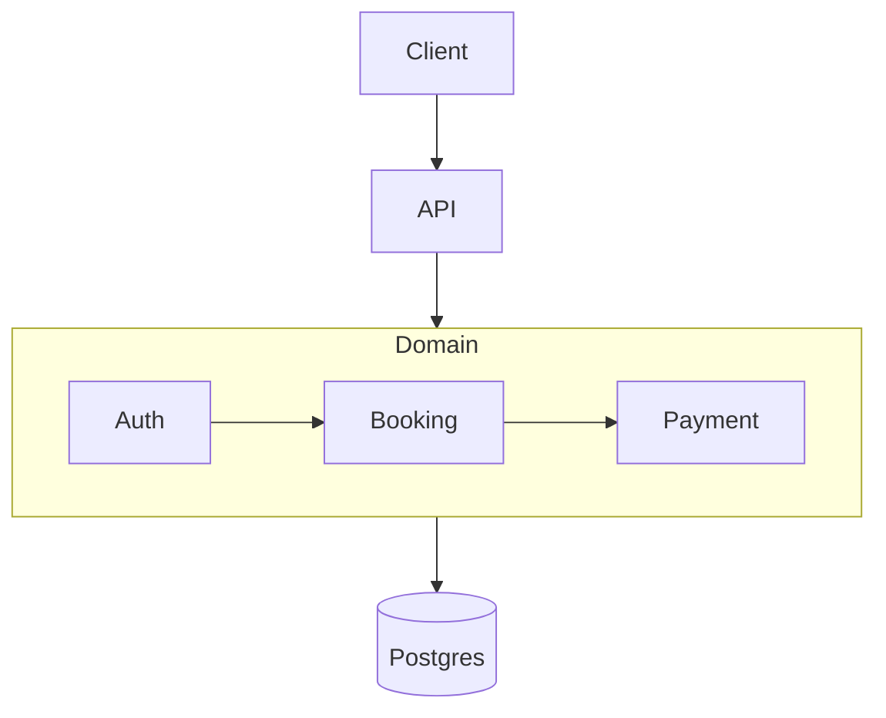

# Profile: monolith

## Description

One application, one deploy, one database. All features live in the same
codebase as internal modules that import each other freely. The simplest
and fastest architecture to build, test, and operate. Best fit for small
to medium projects with a single team where speed-to-market beats
distributed-system flexibility. Easy to refactor inside; harder to scale
horizontally per-feature, but most projects never need that.

## Default tech additions

- **Backend framework:** NestJS (default) | Express | Fastify — REST API in a single process
- **Database:** Postgres (default) | MySQL — single instance, all schemas
- **Migration tool:** Prisma (default) | Knex | Flyway — single `schema.prisma`
- **Cache:** Redis (optional) — sessions, rate limiting, hot reads
- **Job queue:** BullMQ on Redis (optional) | in-process cron — background work
- **Events:** in-process EventEmitter | Node Worker Threads — no broker needed
- **API gateway:** none — single API surface

## Folder structure

```
apps/<slug>/
├── src/
│   ├── api/                      # all HTTP handlers in one tree
│   │   ├── auth/
│   │   ├── booking/
│   │   ├── payment/
│   │   └── notification/
│   ├── services/                 # internal business modules
│   │   ├── auth/
│   │   ├── booking/
│   │   ├── payment/
│   │   └── notification/
│   ├── repositories/             # shared DB access layer
│   ├── shared/                   # types, utils, config
│   ├── workers/                  # background jobs (cron, BullMQ)
│   └── index.ts                  # single entry point
├── prisma/
│   ├── schema.prisma             # single schema, all tables
│   └── migrations/
├── tests/
│   ├── unit/
│   └── integration/
├── package.json                  # ONE package, ONE Dockerfile
├── Dockerfile
├── .env.example
└── README.md
```

## Database approach

**Single Postgres instance.** All tables in one `schema.prisma`. Foreign
keys allowed across modules (`booking.user_id → users.id` is fine).
Modules can JOIN across each other's tables when needed. Migration is a
single linear history.

- Tool: Prisma migrate (default)
- Cross-module data: direct SQL JOINs allowed
- Schema ownership: shared — all modules can read each other's tables
- Caveat: as the project grows, expect to add boundaries via Prisma
  schema folders (`prisma/auth/`, `prisma/booking/`) but the DB stays one

## Communication style

**Direct in-process function calls.** Modules import each other's
service files directly:

```ts
// src/api/booking/handler.ts
import { sendNotification } from '../../services/notification';
await sendNotification(userId, 'booked');
```

- Sync: direct imports between modules — no interfaces required
- Async: in-process EventEmitter for fire-and-forget side effects
- Boundary discipline: loose — speed > strict separation
- No network overhead, no serialization, no distributed-system pain

## Mermaid diagram patterns

### System architecture diagram

One outer subgraph per layer (Client / API / Domain / Data / External).
All services live inside the Domain subgraph as single nodes. No network
arrows — only logical flow.



### Database diagram

Single `erDiagram` block — all entities together. FK lines cross module
boundaries freely.

### Infrastructure diagram

One web app + one API + one Postgres + (optional) Redis + external
integrations. No message broker, no service mesh, no gateway.
