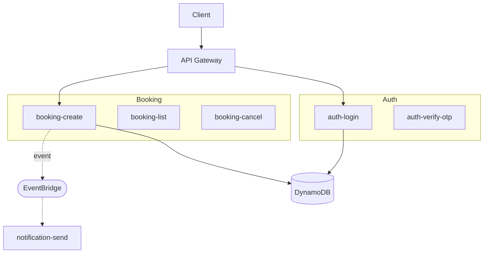

# Profile: serverless

## Description

Functions, not servers. Each piece of business logic deploys as an
independent function on AWS Lambda, Cloudflare Workers, or Vercel
Functions. Pay per request. Scale automatically. Stateless by design.
Best fit for spiky / unpredictable traffic, JAMstack-style web apps,
edge-distributed APIs, or projects where ops cost beats infra cost.
Tradeoffs: cold starts, vendor lock-in considerations, harder local
dev, no long-lived connections (use serverless DB clients).

## Default tech additions

- **Function platform:** AWS Lambda (default) | Cloudflare Workers | Vercel Functions
- **API surface:** AWS API Gateway (default) | Cloudflare R2/Workers | Vercel Edge — routes traffic to functions
- **Database:** DynamoDB (default for AWS) | PlanetScale | Supabase | Neon — serverless-friendly
- **Cache / KV:** ElastiCache Serverless | Cloudflare KV | Upstash Redis — connection-pool-friendly
- **Async events:** EventBridge (default) | SQS+SNS | Kafka-as-a-service (Confluent Cloud / AWS MSK Serverless)
- **Auth:** AWS Cognito | Clerk | Auth0 — managed auth, not in-house
- **Storage:** S3 | Cloudflare R2 — for files, no app-server filesystem
- **Build / deploy:** Serverless Framework (default) | AWS SAM | SST | CDK
- **Tracing:** AWS X-Ray | OpenTelemetry on Lambda

## Folder structure

```
apps/<slug>/
├── functions/                      # each function = one deploy unit
│   ├── auth-login/
│   │   ├── handler.ts
│   │   ├── package.json            # own minimal deps
│   │   └── serverless.yml          # or function-specific config
│   ├── auth-verify-otp/
│   ├── booking-create/
│   ├── booking-list/
│   ├── booking-get/
│   ├── booking-cancel/
│   ├── payment-checkout/
│   ├── payment-webhook/            # external callbacks (Stripe, etc.)
│   ├── notification-send/
│   └── job-cron-reminders/         # scheduled functions
├── shared/
│   ├── db/                         # serverless DB client (singleton, lazy-init)
│   ├── auth/                       # JWT verification helper
│   ├── types/
│   └── events/                     # EventBridge event helpers
├── infrastructure/
│   ├── api-gateway.yml             # routes function URLs to handlers
│   ├── dynamodb-tables.yml         # NoSQL table definitions
│   ├── eventbridge.yml             # async event bus rules
│   ├── cognito.yml                 # auth pool
│   └── s3-buckets.yml
├── serverless.yml                  # root deploy config (per stage: dev/staging/prod)
├── package.json
└── README.md
```

## Database approach

**Serverless-native DB. NoSQL preferred OR connection-pool-friendly SQL.**

- DynamoDB (default for AWS) — single-table design, GSIs for access patterns
- Connection-pool-friendly Postgres options: PlanetScale, Supabase, Neon, Aurora Serverless v2
- Avoid: traditional Postgres on a single instance — connection storms during traffic spikes will kill it
- Each function reads/writes via a SHARED serverless-friendly client (lazy init in module scope)
- Schema migrations: tool depends on DB choice (Prisma works with PlanetScale/Neon; for DynamoDB use AWS CDK or Serverless Framework definitions)
- Cross-function references: store IDs, NOT relations
- Read patterns design FIRST, schema follows — DynamoDB is access-pattern-driven

## Communication style

**Functions don't call each other directly. They emit events.**

- **Sync within a request:** one function handles end-to-end. Don't fan out to other functions for sync work — use shared `shared/` modules.
- **Async events:** publish to EventBridge / SNS / Kafka-as-a-service. Other functions subscribe.
- **External callbacks:** dedicated webhook function (e.g. `payment-webhook/`) parses provider callbacks and emits internal events.
- **Boundary discipline:** strict — each function has minimal deps, no shared global state.
- **Auth:** every function validates JWT via `shared/auth/` helper at the top.

```ts
// functions/booking-create/handler.ts
import { db } from '@shared/db';
import { eventBridge } from '@shared/events';
import { verifyJwt } from '@shared/auth';

export const handler = async (event) => {
  const user = verifyJwt(event.headers.Authorization);
  const booking = await db.bookings.create({ ...event.body, userId: user.id });
  await eventBridge.publish('booking.created', { bookingId: booking.id });
  return { statusCode: 200, body: JSON.stringify(booking) };
};
```

## Mermaid diagram patterns

### System architecture diagram

API Gateway as the entry point, fanning out to function nodes. Each
function is a small box. Group functions by feature using subgraphs
(Auth / Booking / Payment / Notification). Show event bus
(EventBridge / SNS) as a horizontal bus. DynamoDB / Postgres-as-a-service
shown as cylinder nodes that ALL functions can reach (via shared client).
S3 / object storage as separate cylinder.



### Database diagram

For DynamoDB: NOT an `erDiagram` (relations don't fit). Use a TABLE
showing access patterns, partition keys, sort keys, GSIs. For SQL
serverless DBs: regular `erDiagram` works.

### Infrastructure diagram

API Gateway in front. Functions grouped by feature. Event bus as a
horizontal element. DB cylinder. S3 cylinder. Cognito (or other auth)
shown as a separate node. No "servers" — use lambda icons (or just
function-shaped nodes) to make the serverless nature visible.
